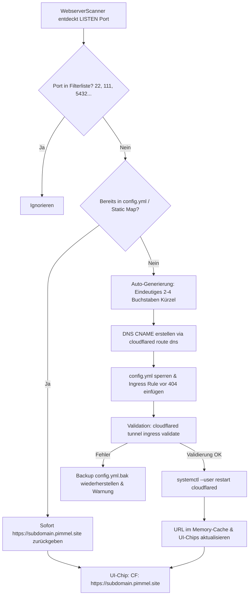

# AGY.md — Antigravity Projekt-Verknüpfung & Systemarchitektur

Projekt: agydashboard  
Pfad: `/home/yash/Projects/agydashboard`  
GitHub: `https://github.com/yash130384/agydashboard`  

## Zweck
Dashboard-Projekt. Antigravity nutzt dieses Verzeichnis als Workspace (Start mit `agy --project agydashboard` oder `cd` hierher + `agy`).

## Konventionen
- Sprache: Deutsch für Dokumentation, Englisch für Quellcode & Variablen.
- Commits: Conventional Commits `type: subject` (`fix:`, `feat:`, `docs:`, `chore:`).

---

# Architektur- & Implementierungsplan: Migration auf Cloudflare Named Tunnel (`pimmel.site`)

## 1. Zielsetzung & Übersicht

Alle Cloudflare-Tunnel des `agydashboard` werden vollständig von unzuverlässigen, temporären `*.trycloudflare.com` Quick-Tunnels auf den offiziellen Named Tunnel **`pimmel-tunnel`** unter der Domain **`pimmel.site`** umgestellt.

### Eckdaten der Infrastruktur
| Komponente | Pfad / Bezeichner | Zweck / Konfiguration |
|---|---|---|
| **Named Tunnel Name** | `pimmel-tunnel` | Fester Cloudflare Named Tunnel |
| **Tunnel UUID** | `b5c7fa60-f43e-487e-bad6-70975ca93823` | Cloudflare Tunnel ID |
| **Konfigurationsdatei** | `/home/yash/.cloudflared/config.yml` | Ingress-Regeln & Credentials |
| **Credentials Datei** | `/home/yash/.cloudflared/b5c7fa60-f43e-487e-bad6-70975ca93823.json` | Tunnel Auth Key |
| **Cloudflared Binary** | `/home/yash/bin/cloudflared` | CLI & Tunnel Connector Binary |
| **Systemd Service** | `cloudflared.service` (User Mode) | `systemctl --user restart cloudflared` |
| **Basis-Domain** | `pimmel.site` | Offizielle Domain mit Cloudflare DNS & TLS |

---

## 2. Definierte Service-Subdomains (2–4 Buchstaben)

Alle bekannten und primären Systemdienste erhalten prägnante Subdomains von 2 bis maximal 4 Buchstaben:

| Subdomain | Vollständige URL | Lokaler Port | Dienst / Prozess | Aktueller Status |
|---|---|---|---|---|
| **ha** | `https://ha.pimmel.site` | `8123` | Home Assistant Core (`hass`) | Bereits in `config.yml` & DNS aktiv |
| **ai** | `https://ai.pimmel.site` | `20128` | 9Router AI Gateway (`next-server`) | Bereits in `config.yml` & DNS aktiv |
| **dash** | `https://dash.pimmel.site` *(sowie `https://pimmel.site`)* | `5000` | agydashboard System Dashboard | `pimmel.site` aktiv; `dash` neu |
| **cast** | `https://cast.pimmel.site` | `3000` | xdcc-load-cast / PulseCast (`node`) | Neu anzulegen |
| **tele** | `https://tele.pimmel.site` | `8000` | TelemetryVault ACC Telemetry (`uvicorn`) | Neu anzulegen |
| **mat** | `https://mat.pimmel.site` | `5580` | Python Matter Server (`matter-server`) | Neu anzulegen |
| **head** | `https://head.pimmel.site` | `8787` | Headroom AI Context Compression | Neu anzulegen |

---

## 3. Architektur des dynamischen Named-Tunnel-Managers

Anstelle des bisherigen `CloudflaredTunnelManager`, der eigene Subprozesse mit `--url http://127.0.0.1:<port>` gestartet hat, übernimmt künftig ein thread-sicherer **`CloudflaredNamedTunnelManager`** die Verwaltung:



### 3.1 Subdomain-Generierungs-Algorithmus (2–4 Zeichen)
Für neu gefundene Webdienste erzeugt die Funktion `generate_subdomain(port, process_name, title)` automatisch ein valides Kürzel:
1. **Prioritäts-Lookup**: Prüfen, ob für den Port ein statischer Eintrag in `STATIC_PORT_SUBDOMAINS` existiert.
2. **Kandidaten aus Namen extrahieren**:
   - Bereinigen von `process_name` / `title` (nur `a-z0-9`, Kleinbuchstaben).
   - Generische Namen wie `python`, `node`, `docker`, `system` werden übersprungen.
   - Prägnante 3-4 Buchstaben-Präfixe (z.B. `grafana` -> `graf`, `ollama` -> `olla`, `plex` -> `plex`, `caddy` -> `cad`).
3. **Fallback bei Namenskollision oder generischen Diensten**:
   - `s` + letzte 2-3 Stellen des Ports (z.B. Port `8080` -> `s808`, Port `9000` -> `s900`, Port `4200` -> `s420`).
   - Garantiert strikt das Format: `^[a-z0-9]{2,4}$`.
4. **Kollisionsprüfung**:
   - Prüfung gegen alle bereits in `/home/yash/.cloudflared/config.yml` vorhandenen Hostnames und DNS-Reservierungen.

### 3.2 DNS-Provisionierung
Für jedes neue Kürzel wird folgender Befehl ausgeführt:
```bash
/home/yash/bin/cloudflared tunnel route dns -f pimmel-tunnel <subdomain>.pimmel.site
```
- `-f` (`--overwrite-dns`): Überschreibt eventuell verwaiste alte DNS-Records sicher.
- Nutzt die existierenden Credentials in `/home/yash/.cloudflared/cert.pem`.

### 3.3 Ingress-Regel in `config.yml` atomar einpflegen
Die Konfiguration `/home/yash/.cloudflared/config.yml` besitzt die Ingress-Struktur:
```yaml
tunnel: b5c7fa60-f43e-487e-bad6-70975ca93823
credentials-file: /home/yash/.cloudflared/b5c7fa60-f43e-487e-bad6-70975ca93823.json

ingress:
  - hostname: pimmel.site
    service: http://localhost:5000
  - hostname: dash.pimmel.site
    service: http://localhost:5000
  - hostname: ha.pimmel.site
    service: http://localhost:8123
  - hostname: ai.pimmel.site
    service: http://localhost:20128
  - hostname: cast.pimmel.site
    service: http://localhost:3000
  - hostname: tele.pimmel.site
    service: http://localhost:8000
  - hostname: mat.pimmel.site
    service: http://localhost:5580
  - hostname: head.pimmel.site
    service: http://localhost:8787
  # [Dynamische Ingress-Regeln werden hier eingefügt]
  - service: http_status:404
```
**Sicherheitsmechanismus:**
- Vor jedem Schreibvorgang wird `/home/yash/.cloudflared/config.yml.bak` erstellt.
- Neue Hostname-Einträge werden *vor* dem Catch-All `- service: http_status:404` eingefügt.
- Nach dem Schreiben erfolgt die Validierung via:
  ```bash
  /home/yash/bin/cloudflared tunnel --config /home/yash/.cloudflared/config.yml ingress validate
  ```
- Nur wenn die Validierung `OK` (Exit-Code 0) zurückgibt, wird der Daemon neu gestartet. Andernfalls erfolgt ein sofortiges Rollback.

### 3.4 Tunnel-Service Neustart
```bash
systemctl --user restart cloudflared
```
Erfolgt über Python `subprocess.run(["systemctl", "--user", "restart", "cloudflared"], check=True)`.
Ein Mutex (`threading.Lock`) und ein kurzes Cooldown-Debouncing (3–5 Sekunden) verhindern mehrfache Neustarts bei Scans mehrerer neuer Ports.

---

## 4. Vollständige Bereinigung aller alten Quick-Tunnel

1. **Beenden aller aktiven Quick-Tunnel-Prozesse**:
   - Suche aller Prozesse mit `cmdline` enthält `cloudflared` und `--url` oder `.trycloudflare.com` und Senden von `SIGTERM` / `SIGKILL`.
2. **Deaktivierung des alten systemd-Dienstes**:
   ```bash
   systemctl --user stop cloudflared-tunnels.service || true
   systemctl --user disable cloudflared-tunnels.service || true
   ```
3. **Bereinigung alter Dateien**:
   - Entfernen oder Leeren von `/tmp/cloudflared_*.log`.
   - Migration bzw. Aufräumen von `/home/yash/.cloudflared-urls/*.url`.
   - Ersetzen von `/home/yash/bin/cloudflared-tunnel.sh` durch ein Deprecation-Script oder Stilllegung.
4. **Code-Bereinigung in `app.py`**:
   - Entfernung aller Regex-Suchen nach `trycloudflare.com`.
   - Entfernung von `subprocess.Popen([self.binary_path, "tunnel", "--url", ...])`.

---

## 5. Änderungen im Detail (File by File)

### 5.1 `/home/yash/.cloudflared/config.yml`
- Eintragen der 7 festen Services (`pimmel.site`, `dash`, `ha`, `ai`, `cast`, `tele`, `mat`, `head`).
- Catch-All Regel `- service: http_status:404` am Ende sicherstellen.

### 5.2 DNS CNAMEs via Cloudflared CLI
Ausführen der initialen Registrierungen:
```bash
/home/yash/bin/cloudflared tunnel route dns -f pimmel-tunnel dash.pimmel.site
/home/yash/bin/cloudflared tunnel route dns -f pimmel-tunnel cast.pimmel.site
/home/yash/bin/cloudflared tunnel route dns -f pimmel-tunnel tele.pimmel.site
/home/yash/bin/cloudflared tunnel route dns -f pimmel-tunnel mat.pimmel.site
/home/yash/bin/cloudflared tunnel route dns -f pimmel-tunnel head.pimmel.site
```

### 5.3 `/home/yash/Projects/agydashboard/app.py`
1. **`SERVICE_REGISTRY`**:
   - Hinzufügen von `mat` (5580, `Matter Server`).
   - Vorkonfigurierte `cf_url`-Einträge:
     - `dashboard` (5000): `https://dash.pimmel.site`
     - `telemetry` (8000): `https://tele.pimmel.site`
     - `xdcc` (3000): `https://cast.pimmel.site`
     - `9router` (20128): `https://ai.pimmel.site`
     - `headroom` (8787): `https://head.pimmel.site`
     - `homeassistant` (8123): `https://ha.pimmel.site`
     - `matter` (5580): `https://mat.pimmel.site`
2. **Klasse `CloudflaredNamedTunnelManager`**:
   - `get_url(port)`: Liest statische & dynamische Zuordnungen aus `config.yml` oder Cache (`https://<subdomain>.pimmel.site`).
   - `ensure_tunnel(port, process_name="", title="")`: Prüft `config.yml`, generiert Subdomain falls unbekannt, erstellt DNS-Eintrag, fügt Ingress-Regel ein, validiert & startet `cloudflared.service` neu.
   - `kill_legacy_quick_tunnels()`: Tötet laufende Quick-Tunnel-Prozesse beim Start.
   - `stop_tunnel(port)`: Entfernt Ingress-Regel optional bei Dienst-Beendigung oder belässt sie persistent.
3. **`get_cloudflared_urls()`**:
   - Gibt das Mapping aller Ports/Dienste auf ihre `https://<subdomain>.pimmel.site` URLs zurück.
4. **`WebserverScanner.scan()` & `get_cloudflared_map()`**:
   - Verwendet direkt `cf_tunnel_manager.get_all_urls()` bzw. `ensure_tunnel(port)`.
   - Bereitstellung sauberer `cloudflared_url` Werte für alle erkannten Server.
5. **UI-Chips & Templates**:
   - Jinja2-Template & JavaScript-Aktualisierung:
     - Badge zeigt direkt den sauberen Link: `☁️ CF: https://<subdomain>.pimmel.site` (oder gekürzt `☁️ <subdomain>.pimmel.site`).
     - Kein Lade-Hänger mehr wegen fehlender Quick-Tunnel-Logs.

---

## 6. Verifikationsplan

### Schritt 1: DNS- und Tunnel-Auflösung
```bash
python3 -c "
import socket
for sub in ['dash', 'ha', 'ai', 'cast', 'tele', 'mat', 'head']:
    host = f'{sub}.pimmel.site'
    print(host, '->', socket.gethostbyname(host))
"
```
*Erwartung*: Alle 7 Subdomains lösen auf Cloudflare Edge IPs (z.B. `188.114.96.4` / `188.114.97.4`) auf.

### Schritt 2: Ingress-Konfiguration und Validierung
```bash
/home/yash/bin/cloudflared tunnel --config /home/yash/.cloudflared/config.yml ingress validate
```
*Erwartung*: `Validating rules... OK`.

### Schritt 3: Systemd-Status & Prozessprüfung
```bash
systemctl --user status cloudflared
systemctl --user status cloudflared-tunnels.service  # Soll inaktiv/disabled sein
ps aux | grep -E "cloudflared.*--url"               # Soll 0 Treffer liefern
```

### Schritt 4: End-to-End HTTP(S)-Aufrufe
Prüfung der HTTPS-Routen von extern/über Cloudflare:
- `https://dash.pimmel.site` -> HTTP 200 (agydashboard)
- `https://ha.pimmel.site` -> Home Assistant Login
- `https://ai.pimmel.site` -> 9Router Gateway
- `https://cast.pimmel.site` -> PulseCast / XDCC
- `https://tele.pimmel.site` -> TelemetryVault
- `https://mat.pimmel.site` -> Matter Server

### Schritt 5: Dynamische Auto-Generierung testen
Simulierter Testlauf: Starten eines Test-HTTP-Servers auf Port 8899:
```bash
python3 -m http.server 8899 &
```
- Überprüfen, ob `agydashboard` den Server erkennt.
- Überprüfen, ob ein 2-4 Buchstaben-Kürzel generiert wird.
- Überprüfen, ob `config.yml` aktualisiert und `cloudflared` neu gestartet wird.
- Beenden des Test-Servers.

### Schritt 6: Dashboard-UI Verifikation
Aufruf des Dashboards unter `http://localhost:5000` bzw. `https://dash.pimmel.site`:
- Überprüfung der Chips in der LCARS Webserver-Liste: Jeder Server zeigt einen `☁️ CF: https://<subdomain>.pimmel.site` Chip, der per Klick die Seite öffnet.

---

# PulseCast Media & XDCC Erweiterungen

## 1. Direkte Wiedergabe im lokalen Media Player (HTTP Range Streaming)
- **Streaming-Proxy-Endpunkt**:
  `GET /api/pulsecast/media/stream/<path:filename>` (sowie `HEAD`)
  Leitet native HTTP Range Requests transparent an `http://127.0.0.1:3000/api/media/stream/<filename>` weiter.
  - Transparente Weiterleitung von Request-Headern (`Range`, `If-Range`).
  - Durchreichen relevanter Response-Header (`206 Partial Content`, `Content-Range`, `Accept-Ranges: bytes`, `Content-Type`, `Content-Length`, `Cache-Control`, `ETag`, `Last-Modified`).
  - Flüssiges Seeken und latenzfreies Streaming ohne `.m3u` Playlist-Download.
- **LCARS Media Player Modal (`#pulsecastPlayerModal`)**:
  - **VLC Media Player**: Ruft `vlc://<stream_url>` auf.
  - **PotPlayer (Windows)**: Ruft `potplayer://<stream_url>` auf.
  - **IINA (macOS)**: Ruft `iina://weblink?url=<encoded_url>` auf.
  - **nPlayer (Mobile)**: Ruft `nplayer-<stream_url>` auf.
  - **Web-Player (Browser)**: Integriertes LCARS HTML5 `<video controls autoplay playsinline>` Player-Modal direkt im Dashboard.
  - **Im neuen Tab öffnen**: Direkte Wiedergabe via `window.open(streamUrl, '_blank')`.
  - **Stream-URL kopieren**: Kopiert direkte HTTP Range Stream-URL in die Zwischenablage inkl. optischer Erfolgsanzeige.
- **UI-Aktion `▶ IN PLAYER ÖFFNEN`**:
  - In der Download-Warteschlange bei Status `completed` (FERTIG).
  - Im Katalog-Browser bei lokalen Mediendateien (`isXtream === false`).
  - Im Episoden-Modal bei lokal verfügbaren Serien-Episoden.

## 2. XDCC-Suche: Quellenauswahl & Movie Gods Top-Downloads
- **Quellenauswahl**:
  - LCARS-Pills in der XDCC-Suchmaske: `XDCC.EU Relay` (Standard) und `Movie Gods (IRC)`.
- **Movie Gods Top-Downloads / Favoriten**:
  - Bei aktiver Movie Gods Quelle wird der Bereich `⭐ MOVIE GODS TOP-DOWNLOADS / FAVORITEN` eingeblendet.
  - Button `⭐ TOP-DOWNLOADS / FAVORITEN LADEN` ruft `/api/pulsecast/search?q=!topdl&source=moviegods` ab.
  - LCARS-Tabelle mit Spalten: `GETS` (z.B. 265x), `DATEINAME`, `GRÖSSE`, `AKTION` (`🔍 SUCHEN`).
  - Klick auf einen Top-Download übernimmt den Dateinamen sofort in das Suchfeld, setzt die Quelle auf Movie Gods und führt die Suche nach Bots & Packs sofort aus.
- **Parametrisierung & Download**:
  - Übergabe von `source=moviegods` an `/api/pulsecast/search`.
  - Beim Download via `/api/pulsecast/download/xdcc` wird automatisch der Channel `#moviegods` gesetzt.

---

# Architektur- & Implementierungsplan: Zentrale User-Verwaltung & Cloudflare-Zugangsabsicherung (*.pimmel.site)

## 1. Zielsetzung & Geltungsbereich

Dieser Architektur- und Umsetzungsplan definiert das Sicherheitsmodell, den Authentifizierungs-Flow, die Benutzeroberfläche und die technische Infrastruktur für eine zentrale Benutzerverwaltung sowie die Absicherung aller externen Zugriffe über den Cloudflare Named Tunnel (`*.pimmel.site`).

### 1.1 Geltungsbereich (Scope-Matrix)
| Dienst / Subdomain | Lokaler Port | Status / Schutzmaßnahme | Begründung / Verhalten |
|---|---|---|---|
| **ha.pimmel.site** | 8123 | **Direkter Durchgriff (Ungeschützt)** | Besitzt bereits ein eigenes, vollwertiges Authentifizierungssystem (Home Assistant Auth). Bleibt direkt in `config.yml` auf Port 8123 geroutet. |
| **ai.pimmel.site** | 20128 | **Direkter Durchgriff (Ungeschützt)** | Besitzt eigenes Authentifizierungssystem (9Router Master Key / Auth). Bleibt direkt auf Port 20128 geroutet. |
| **pimmel.site** / **dash.pimmel.site** | 5000 | **Dashboard & Login-Zentrale** | Enthält den öffentlichen LCARS Login-Bildschirm (`/login`), die zentralen Auth-APIs sowie die Admin-Oberfläche hinter Command-Code `0901`. |
| **cast.pimmel.site** | 3000 | **GESCHÜTZT via Auth-Proxy** | PulseCast besitzt kein eigenes Multi-User-Login. Zugriff erfordert gültige LCARS-Session mit Berechtigung `pulsecast`. |
| **tele.pimmel.site** | 8000 | **GESCHÜTZT via Auth-Proxy** | TelemetryVault ACC Telemetriedienst besitzt kein Login. Zugriff erfordert LCARS-Session mit Berechtigung `telemetryvault`. |
| **mat.pimmel.site** | 5580 | **GESCHÜTZT via Auth-Proxy** | Matter Server Web-UI / WebSocket besitzt kein eigenes Login. Zugriff erfordert LCARS-Session mit Berechtigung `matter`. |
| **head.pimmel.site** | 8787 | **GESCHÜTZT via Auth-Proxy** | Headroom AI Service besitzt kein Login. Zugriff erfordert LCARS-Session mit Berechtigung `headroom`. |
| **port.pimmel.site** | 631 | **GESCHÜTZT via Auth-Proxy** | CUPS Druckerdienst Web-UI besitzt kein Internet-Login. Zugriff erfordert LCARS-Session mit Berechtigung `cups`. |
| *Künftige Webdienste* | dynamisch | **GESCHÜTZT (Default)** | Automatisch erkannte Webdienste werden per Default über den Auth-Proxy abgesichert (Secure by Default). |

### 1.2 Netzwerk-Verhalten: LAN vs. WAN (Zero-Interference-Prinzip)
- **Lokaler Netzwerk-Zugriff (LAN / `192.168.x.x` & `localhost`)**:
  - Lokale Geräte im Heimnetzwerk (Smart TVs, lokale Browser, ACC Telemetrie-Clients, HA-Integrationen, Drucker) verbinden sich direkt mit den lokalen IP-Adressen und Ports (z.B. `http://192.168.31.169:3000` oder `http://localhost:8000`).
  - Diese Verbindungen laufen physisch nicht über Cloudflare und berühren den Auth-Proxy nicht.
  - **Ergebnis**: Absolut freier, latenzfreier und unauthentifizierter Zugriff im gesamten lokalen Netzwerk, exakt wie gefordert.
- **Externer Zugriff (WAN / `*.pimmel.site`)**:
  - Alle externen Zugriffe treffen am Cloudflare Edge ein und werden über den Named Tunnel `pimmel-tunnel` (`cloudflared`) an den Host weitergeleitet.
  - Bei geschützten Subdomains leitet `cloudflared` den Traffic an den lokalen Auth-Reverse-Proxy (`127.0.0.1:5050`) weiter.

---

## 2. Systemarchitektur & Request-Flow

```mermaid
flowchart TD
    subgraph WAN["Externer WAN-Zugriff"]
        Client["Externer Browser / Client"]
    end

    subgraph CloudflareEdge["Cloudflare Edge (*.pimmel.site)"]
        CF["Cloudflare DNS & TLS Edge"]
    end

    subgraph Host["Host System (BiggerPimmel)"]
        CFTunnel["cloudflared pimmel-tunnel\n(Ingress Router)"]
        
        subgraph AuthComponents["LCARS Auth Subsystem"]
            AuthProxy["LCARS Auth-Proxy\n(127.0.0.1:5050 / asyncio)"]
            UserDB[("users.db (SQLite)\nUsers, Sessions, Audit")]
            AgyDash["agydashboard (Port 5000)\n• /login (LCARS UI)\n• /api/auth/*\n• /api/users/* (Code 0901)"]
        end

        subgraph DirectEndpoints["Direkte Dienste (Eigener Auth)"]
            HA["Home Assistant (Port 8123)"]
            AI["9Router (Port 20128)"]
        end

        subgraph ProtectedEndpoints["Geschützte Dienste"]
            PulseCast["PulseCast (Port 3000)"]
            Telemetry["TelemetryVault (Port 8000)"]
            Matter["Matter Server (Port 5580)"]
            Headroom["Headroom (Port 8787)"]
            CUPS["CUPS (Port 631)"]
        end
    end

    subgraph LAN["Lokales Heimnetzwerk (192.168.31.x)"]
        LANClient["Lokaler Client / Smart-TV / ACC"]
    end

    Client -->|HTTPS Request| CF
    CF -->|Tunnel Stream| CFTunnel

    %% Ingress Routing
    CFTunnel -->|ha.pimmel.site:8123| HA
    CFTunnel -->|ai.pimmel.site:20128| AI
    CFTunnel -->|dash.pimmel.site:5000| AgyDash
    CFTunnel -->|pimmel.site:5000| AgyDash

    CFTunnel -->|cast, tele, mat, head, port| AuthProxy

    %% Auth Proxy Validation
    AuthProxy <-->|Session & Rights Check| UserDB
    AuthProxy -- "Nicht eingeloggt (Browser GET)" -->|302 Redirect| AgyDash
    AuthProxy -- "Nicht eingeloggt (API/WS)" -->|401 Unauthorized| Client
    AuthProxy -- "Eingeloggt aber fehlendes Recht" -->|403 LCARS Access Denied| Client
    AuthProxy -- "Autorisiert" -->|HTTP / WS / Range Streaming| ProtectedEndpoints

    %% LAN Direct
    LANClient -.->|Direktzugriff ohne Auth| ProtectedEndpoints
    LANClient -.->|Direktzugriff| DirectEndpoints
    LANClient -.->|Direktzugriff| AgyDash
```

---

## 3. Technische Spezifikation des Auth-Reverse-Proxys (`auth_proxy.py` / Port 5050)

### 3.1 Technologie-Wahl & Performance
- **Engine**: Asynchroner Server basierend auf Standardbibliothek `asyncio` (`asyncio.start_server`).
- **Zero-External-Dependencies**: Läuft out-of-the-box mit Python 3.14 Standardbibliothek.
- **Vorteil gegenüber reinem WSGI/Flask**:
  - Echtes, transparentes **Full-Duplex WebSocket Proxying** (`Upgrade: websocket` Handshake + bidirektionales Socket-Piping).
  - Latenzfreies **HTTP Range Request Streaming** (Video/Audio) ohne RAM-Pufferung durch direkte TCP-Chunk-Weiterleitung.
  - Geringster Ressourcenverbrauch (unter 15 MB RAM, 0% CPU im Leerlauf).

### 3.2 Routing- und Subdomain-Auflösung
Der Proxy ermittelt den Zielport anhand des eingehenden HTTP `Host`-Headers:
```python
SUBDOMAIN_PORT_MAP = {
    "cast": {"port": 3000, "service": "pulsecast"},
    "tele": {"port": 8000, "service": "telemetryvault"},
    "mat": {"port": 5580, "service": "matter"},
    "head": {"port": 8787, "service": "headroom"},
    "port": {"port": 631, "service": "cups"},
}
```
- Neue, dynamisch gefundene Webdienste werden über `CloudflaredNamedTunnelManager` zur Laufzeit in das Mapping synchronisiert.

### 3.3 Authentifizierungs- & Autorisierungs-Algorithmus
1. **Header-Analyse**:
   - Extrahiere Cookie `lcars_session`.
   - Extrahiere Client-IP aus `Cf-Connecting-Ip` (Cloudflare-Header) oder `X-Forwarded-For`.
2. **Session-Validierung**:
   - Session-Lookup in Cache / `users.db`.
   - Prüfen: `expires_at > CURRENT_TIMESTAMP`.
   - Prüfen: `user.is_active == 1`.
3. **Fall 1: Keine oder abgelaufene Session**:
   - Handelt es sich um eine HTML-Browser-Anfrage (`Accept: text/html` oder GET auf Web-Ressource):
     ```http
     HTTP/1.1 302 Found
     Location: https://dash.pimmel.site/login?return_to=https%3A%2F%2Fcast.pimmel.site%2Faktueller%2Fpfad
     Cache-Control: no-store, no-cache, must-revalidate
     ```
   - Handelt es sich um eine API/Fetch-Anfrage oder WebSocket-Handshake:
     ```http
     HTTP/1.1 401 Unauthorized
     Content-Type: application/json

     {"error": "Unauthorized", "login_url": "https://dash.pimmel.site/login"}
     ```
4. **Fall 2: Gültige Session, aber fehlendes Service-Recht**:
   - User hat z.B. nur Berechtigung für `["pulsecast"]`, ruft aber `mat.pimmel.site` (Matter) auf:
   - Rückgabe von **HTTP 403 Forbidden** mit stilsicherer LCARS-Fehlerseite:
     ```html
     LCARS SICHERHEITSPROTOKOLL // ZUGRIFF VERWEIGERT
     STATUS: 403 FORBIDDEN // BENUTZER: {username}
     BERECHTIGUNG FÜR DIENST '{service}' NICHT VORHANDEN.
     ```
5. **Fall 3: Voll autorisiert**:
   - Transparentes Durchreichen an den lokalen Zielport (`127.0.0.1:<target_port>`).
   - Anreicherung nützlicher Upstream-Header:
     - `X-Forwarded-User: {username}`
     - `X-Forwarded-Host: {host}`
     - `X-Forwarded-Proto: https`

---

## 4. Datenmodell & Sicherheit (`users.db`)

### 4.1 SQLite Schema
Gespeichert unter `/home/cb/Projects/agydashboard/users.db` mit aktivierter WAL (`PRAGMA journal_mode=WAL;`).

```sql
-- 1. Benutzerverwaltung
CREATE TABLE IF NOT EXISTS users (
    id INTEGER PRIMARY KEY AUTOINCREMENT,
    username TEXT UNIQUE NOT NULL COLLATE NOCASE,
    password_hash TEXT NOT NULL,
    salt TEXT NOT NULL,
    hash_algo TEXT NOT NULL DEFAULT 'pbkdf2_sha256',
    display_name TEXT,
    is_active INTEGER NOT NULL DEFAULT 1,
    allowed_services TEXT NOT NULL DEFAULT '[]', -- JSON-Array, z.B. ["pulsecast", "telemetryvault"] oder ["*"]
    created_at TIMESTAMP DEFAULT CURRENT_TIMESTAMP,
    last_login_at TIMESTAMP,
    notes TEXT
);

-- 2. Session-Store
CREATE TABLE IF NOT EXISTS sessions (
    session_id TEXT PRIMARY KEY,
    user_id INTEGER NOT NULL REFERENCES users(id) ON DELETE CASCADE,
    created_at TIMESTAMP DEFAULT CURRENT_TIMESTAMP,
    expires_at TIMESTAMP NOT NULL,
    last_activity_at TIMESTAMP DEFAULT CURRENT_TIMESTAMP,
    ip_address TEXT,
    user_agent TEXT
);

-- 3. Audit & Security Log
CREATE TABLE IF NOT EXISTS auth_audit_log (
    id INTEGER PRIMARY KEY AUTOINCREMENT,
    timestamp TIMESTAMP DEFAULT CURRENT_TIMESTAMP,
    username TEXT,
    event TEXT NOT NULL, -- LOGIN_SUCCESS, LOGIN_FAILED, LOGOUT, ACCESS_DENIED, USER_CREATED, USER_DELETED, PASSWORD_CHANGED
    target_service TEXT,
    ip TEXT,
    user_agent TEXT,
    details TEXT
);
```

### 4.2 Passwort-Sicherheit & Hashing-Algorithmus
- **Algorithmus**: `PBKDF2-HMAC-SHA256` mit 600.000 Iterationen (entspricht den aktuellen OWASP Password Storage Guidelines).
- **Salt**: 32 Bytes kryptografischer Zufall via `secrets.token_bytes(32)`.
- **Vergleich**: Konstanter Zeitvergleich via `hmac.compare_digest(calculated_hash, stored_hash)` zur Verhinderung von Side-Channel- / Timing-Angriffen.
- **Modularität**: Automatischer Upgrade-Pfad auf `Argon2id` oder `Bcrypt`, falls diese Bibliotheken im Python-Umfeld nachinstalliert werden.

### 4.3 Session-Management & Cookie-Sicherheit
- **Token-Erzeugung**: 256-Bit Entropie via `secrets.token_urlsafe(32)`.
- **Cookie-Attribute**:
  - `Name`: `lcars_session`
  - `Domain`: `.pimmel.site` (Führender Punkt garantiert Subdomain-weites Senden an `cast.pimmel.site`, `tele.pimmel.site`, etc.)
  - `Path`: `/`
  - `Secure`: `True` (Übertragung ausschließlich via HTTPS über Cloudflare)
  - `HttpOnly`: `True` (Nicht über clientseitiges JavaScript auslesbar, Schutz vor XSS)
  - `SameSite`: `Lax` (Ermöglicht automatische Übertragung bei Weiterleitungen von externen Links)
  - `Max-Age`: Konfigurierbar:
    - Standard: 86.400 Sekunden (24 Stunden).
    - Bei Option "Eingeloggt bleiben" (`remember=true`): 2.592.000 Sekunden (30 Tage).

---

## 5. Authentifizierungs-Flow & LCARS Login-Interface

### 5.1 Ablaufdiagramm (Auth-Flow)

```mermaid
sequenceDiagram
    autonumber
    actor User as Benutzer
    participant CF as Cloudflare Edge
    participant Proxy as Auth-Proxy (Port 5050)
    participant Dash as agydashboard (Port 5000)
    participant DB as users.db (SQLite)
    participant App as Ziel-Dienst (z.B. Port 3000)

    User->>CF: Aufruf https://cast.pimmel.site/downloads
    CF->>Proxy: Ingress HTTP GET (Host: cast.pimmel.site, kein Cookie)
    Proxy->>Proxy: Prüfe Cookie 'lcars_session' -> FEHLT
    Proxy-->>CF: 302 Redirect zu https://dash.pimmel.site/login?return_to=https://cast.pimmel.site/downloads
    CF-->>User: 302 Found
    User->>Dash: GET /login?return_to=https://cast.pimmel.site/downloads
    Dash-->>User: Rendert LCARS Login Terminal
    User->>Dash: POST /api/auth/login {user, pass, remember: true, return_to}
    Dash->>DB: Validiere Hash & erstelle Session
    DB-->>Dash: Session OK (Token: abc...)
    Dash-->>User: Set-Cookie: lcars_session=abc...; Domain=.pimmel.site; Secure; HttpOnly<br>JSON {redirect_url: "https://cast.pimmel.site/downloads"}
    User->>CF: Aufruf https://cast.pimmel.site/downloads (inkl. Cookie!)
    CF->>Proxy: Ingress HTTP GET (Cookie: lcars_session=abc...)
    Proxy->>DB: Validiere Token & prüfe Rechte für 'pulsecast'
    DB-->>Proxy: Valide & Berechtigt!
    Proxy->>App: Forward Request an 127.0.0.1:3000
    App-->>Proxy: Response Data (HTML/Media/JSON)
    Proxy-->>CF: Forward Response Data
    CF-->>User: Darstellung von PulseCast
```

### 5.2 Open-Redirect-Prävention
Der Parameter `return_to` wird vor dem Setzen des Weiterleitungs-Ziels streng validiert:
- Erlaubt sind ausschließlich URLs mit Hostname endend auf `.pimmel.site` (z.B. `https://cast.pimmel.site/*`) oder relative Pfade (z.B. `/`).
- Alle anderen Domains (z.B. `evil.com`) werden strikt verworfen und durch `https://dash.pimmel.site/` ersetzt.

---

## 6. LCARS Administrations-Oberfläche "USER-VERWALTUNG"

### 6.1 Autorisierungskonzept
- **Kein separater Master-Admin-Nutzer**: Die Administration erfolgt direkt über das existierende Sicherheitsmodell mit dem **Command Code `0901`**.
- Nach Eingabe des Command Codes im Dashboard (Bereich `CONFIG` unter `LCARS SICHERHEITSPROTOKOLL`) wird die Sektion `LCARS BENUTZER- & ZUGRIFFSVERWALTUNG` freigeschaltet.

### 6.2 UI-Komponenten in `app.py`
1. **Benutzerliste (LCARS Data Table)**:
   - Spalten:
     - `STATUS`: LCARS Badge (`AKTIV` grün / `GESPERRT` rot).
     - `BENUTZER`: Username und optionaler Anzeigename.
     - `BERECHTIGUNGEN`: Pills für zugeordnete Dienste (`PULSECAST`, `TELEMETRY`, `MATTER`, `HEADROOM`, `CUPS`, `ALLE`).
     - `LETZTER LOGIN`: Datum, Uhrzeit und Herkunfts-IP.
     - `AKTIONEN`:
       - `✏️ EDITIEREN`: Rechte und Details ändern.
       - `🔑 PASSWORT`: Direktes Zurücksetzen/Ändern des Passworts.
       - `🔄 TOGGLE`: Sofortiges Deaktivieren / Aktivieren.
       - `🗑️ LÖSCHEN`: Löschen mit LCARS Bestätigungs-Prompt.
2. **Modal "NEUER BENUTZER"**:
   - Benutzername (mind. 3 Zeichen, nur `a-z0-9_-`).
   - Initial-Passwort (mind. 6 Zeichen mit Sichtbarkeits-Toggle).
   - Berechtigungs-Matrix (Checkboxen):
     - `[ ] Alle Dienste (*)`
     - `[ ] PulseCast (cast.pimmel.site - Media & Downloads)`
     - `[ ] TelemetryVault (tele.pimmel.site - ACC Telemetrie)`
     - `[ ] Matter Server (mat.pimmel.site - Smart Home)`
     - `[ ] Headroom AI (head.pimmel.site - Context Engine)`
     - `[ ] CUPS Druckerdienst (port.pimmel.site - Druckerverwaltung)`
   - Notizfeld (z.B. "Familienmitglied", "Kollege").
3. **LCARS Audit-Log Terminal**:
   - Live-Stream der letzten 25 Authentifizierungs- und Zugriffsereignisse inkl. Farbcodierung (Erfolg grün, Fehlversuche rot, Sperren gelb).

---

## 7. REST-API-Schnittstellenspezifikation

### 7.1 Öffentliche Authentifizierungs-Endpunkte
| Methode | Endpunkt | Beschreibung | Request Body | Response |
|---|---|---|---|---|
| `GET` | `/login` | Rendert LCARS Login-Oberfläche (oder Redirect falls eingeloggt) | - | HTML |
| `POST` | `/api/auth/login` | Führt Login aus & setzt `.pimmel.site` Session-Cookie | `{"username", "password", "remember", "return_to"}` | `{"success": true, "redirect_url": "..."}` |
| `POST` | `/api/auth/logout` | Löscht Session in DB & entfernt Cookie | - | `{"success": true}` |
| `GET` | `/api/auth/me` | Gibt Profil und erlaubte Services des eingeloggten Nutzers zurück | Cookie | `{"authenticated": true, "user": {...}}` |

### 7.2 Administrative Benutzerverwaltung (Erfordert Command Code 0901)
*Header: `X-Command-Code: 0901` oder verifizierte Dashboard-Session.*

| Methode | Endpunkt | Beschreibung | Request Body |
|---|---|---|---|
| `GET` | `/api/users` | Liste aller angelegten Benutzer | - |
| `POST` | `/api/users` | Neuen Benutzer anlegen | `{"username", "password", "allowed_services", "notes"}` |
| `PUT` | `/api/users/<id>` | Benutzerdaten & Rechte bearbeiten | `{"allowed_services", "is_active", "notes"}` |
| `POST` | `/api/users/<id>/password` | Passwort eines Benutzers ändern | `{"new_password"}` |
| `DELETE` | `/api/users/<id>` | Benutzer unwiderruflich löschen | - |
| `GET` | `/api/users/audit-log` | Audit-Events und letzte Anmeldungen | - |

---

## 8. Konfigurationsanpassung: `config.yml` & `CloudflaredNamedTunnelManager`

### 8.1 Neue Ingress-Struktur in `/home/cb/.cloudflared/config.yml`
```yaml
tunnel: b5c7fa60-f43e-487e-bad6-70975ca93823
credentials-file: /home/cb/.cloudflared/b5c7fa60-f43e-487e-bad6-70975ca93823.json

ingress:
  # 1. Zentrale Dashboards & Login
  - hostname: pimmel.site
    service: http://localhost:5000
  - hostname: dash.pimmel.site
    service: http://localhost:5000

  # 2. Direkter Durchgriff (Dienste mit eigenem Login)
  - hostname: ha.pimmel.site
    service: http://localhost:8123
  - hostname: ai.pimmel.site
    service: http://localhost:20128

  # 3. GESCHÜTZTE DIENSTE (Routing über zentralen LCARS Auth-Proxy auf Port 5050)
  - hostname: cast.pimmel.site
    service: http://localhost:5050
  - hostname: tele.pimmel.site
    service: http://localhost:5050
  - hostname: mat.pimmel.site
    service: http://localhost:5050
  - hostname: head.pimmel.site
    service: http://localhost:5050
  - hostname: port.pimmel.site
    service: http://localhost:5050

  # 4. Catch-All Fallback
  - service: http_status:404
```

### 8.2 Anpassung im `CloudflaredNamedTunnelManager` (`app.py`)
- Beim automatischen Entdecken eines neuen Webdienstes wird geprüft, ob er in einer Whitelist für eigene Authentifizierung liegt.
- Alle ungeschützten Dienste werden in `config.yml` mit `service: http://localhost:5050` angelegt, während das interne Subdomain-zu-Port-Mapping dynamisch im Auth-Proxy registriert wird.

---

## 9. Risiken, Edge-Cases & Sicherheitsmaßnahmen

1. **Cookie-Kollisionen mit Subdomains**:
   - Das Cookie `lcars_session` gilt für `.pimmel.site`. Da Home Assistant (`ha`) und 9Router (`ai`) eigene Session-Cookies (`auth_token`, etc.) verwenden, stört das zusätzliche Cookie den Betrieb nicht.
2. **WebSocket Keep-Alive & Timeouts**:
   - Matter Server (`mat`) und PulseCast nutzen WebSockets.
   - Nach Validierung des initialen HTTP-Handshakes schaltet der Proxy auf reines, transparentes TCP-Socket-Streaming um (`asyncio.gather(pipe(r1, w2), pipe(r2, w1))`), sodass keine vorzeitigen HTTP-Timeouts Verbindungen abbrechen.
3. **HTTP Range Requests & Media Streaming**:
   - PulseCast überträgt Filme und Videos über Range Requests. Der Proxy liest und schreibt Datenströme in Chunks (64 KB) direkt durch, ohne den Gesamtrecord im Arbeitsspeicher zu halten.
4. **Timing Attacks**:
   - Alle Passwortvergleiche und Tokenprüfungen verwenden `hmac.compare_digest`.
5. **Cloudflare Header Trust**:
   - Client-IPs werden aus `Cf-Connecting-Ip` bezogen, da der Zugriff über den offiziellen Named Tunnel erfolgt.
6. **Graceful Fallback bei Teilausfall**:
   - Da Home Assistant (`ha`) und 9Router (`ai`) direkt in `config.yml` konfiguriert sind, bleiben sie selbst bei Wartungsarbeiten oder Neustarts des Auth-Proxys unterbrechungsfrei erreichbar.

---

## 10. Detaillierter Umsetzungs- und Verifikationsplan

### Phase 1: Datenhaltung & User-Service (`user_service.py`)
- Implementierung der SQLite-Datenbank `users.db` mit Tabellen `users`, `sessions`, `auth_audit_log`.
- PBKDF2-HMAC-SHA256 mit 600.000 Iterationen und 32-Byte Salting.
- Unit-Tests für Password-Hashing, Session-Generierung und Rechteabfrage.

### Phase 2: Asynchroner Auth Reverse Proxy (`auth_proxy.py`)
- Implementierung des Proxy-Servers auf `127.0.0.1:5050` mit `asyncio`.
- Parsing von HTTP Request-Headern (`Host`, `Cookie`, `Upgrade`).
- Session- und Rechte-Validierung.
- Weiterleitung von HTTP, Streaming & WebSockets an die Ziel-Ports (3000, 8000, 5580, 8787, 631).
- Automatisierter Test mit simulierten Requests (unauthentifiziert -> 302 / 401; authentifiziert -> 200).

### Phase 3: Login-Flow & API-Endpunkte in `app.py`
- Integration von `/login` mit LCARS-Benutzeroberfläche.
- Endpunkte `/api/auth/login`, `/api/auth/logout`, `/api/auth/me`.
- Setzen des sicheren Cookies für `.pimmel.site`.

### Phase 4: LCARS User-Verwaltung in `app.py` (Command Code 0901)
- Freischaltung der User-Verwaltung im Bereich `CONFIG` nach Eingabe von `0901`.
- Endpunkte `/api/users` (GET, POST, PUT, DELETE) und `/api/users/audit-log`.
- Interaktive UI: User anlegen, Rechte pro Dienst zuweisen, Passwort ändern, löschen.

### Phase 5: Tunnel-Umstellung & End-to-End Verifikation
- Aktualisierung von `/home/cb/.cloudflared/config.yml` (Geschützte Dienste auf Port 5050).
- Validierung via `/usr/bin/cloudflared tunnel --config /home/cb/.cloudflared/config.yml ingress validate`.
- Neustart via `systemctl --user restart cloudflared`.
- End-to-End-Prüfung aller Subdomains im Browser.
