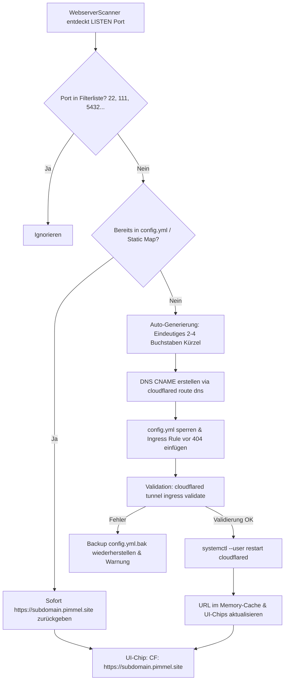
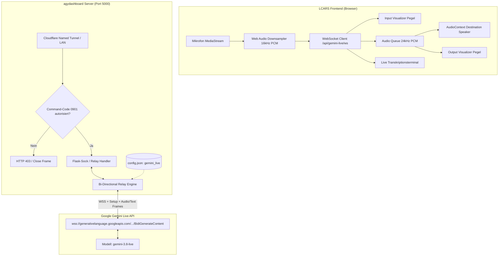

# AGY.md — Antigravity Projekt-Verknüpfung & Systemarchitektur

Projekt: agydashboard  
Pfad: `/home/yash/Projects/agydashboard`  
GitHub: `https://github.com/yash130384/agydashboard`  

## Zweck
Dashboard-Projekt. Antigravity nutzt dieses Verzeichnis als Workspace (Start mit `agy --project agydashboard` oder `cd` hierher + `agy`).

## Konventionen
- Sprache: Deutsch für Dokumentation, Englisch für Quellcode & Variablen.
- Commits: Conventional Commits `type: subject` (`fix:`, `feat:`, `docs:`, `chore:`).

---

# Architektur- & Implementierungsplan: Migration auf Cloudflare Named Tunnel (`pimmel.site`)

## 1. Zielsetzung & Übersicht

Alle Cloudflare-Tunnel des `agydashboard` werden vollständig von unzuverlässigen, temporären `*.trycloudflare.com` Quick-Tunnels auf den offiziellen Named Tunnel **`pimmel-tunnel`** unter der Domain **`pimmel.site`** umgestellt.

### Eckdaten der Infrastruktur
| Komponente | Pfad / Bezeichner | Zweck / Konfiguration |
|---|---|---|
| **Named Tunnel Name** | `pimmel-tunnel` | Fester Cloudflare Named Tunnel |
| **Tunnel UUID** | `b5c7fa60-f43e-487e-bad6-70975ca93823` | Cloudflare Tunnel ID |
| **Konfigurationsdatei** | `/home/yash/.cloudflared/config.yml` | Ingress-Regeln & Credentials |
| **Credentials Datei** | `/home/yash/.cloudflared/b5c7fa60-f43e-487e-bad6-70975ca93823.json` | Tunnel Auth Key |
| **Cloudflared Binary** | `/home/yash/bin/cloudflared` | CLI & Tunnel Connector Binary |
| **Systemd Service** | `cloudflared.service` (User Mode) | `systemctl --user restart cloudflared` |
| **Basis-Domain** | `pimmel.site` | Offizielle Domain mit Cloudflare DNS & TLS |

---

## 2. Definierte Service-Subdomains (2–4 Buchstaben)

Alle bekannten und primären Systemdienste erhalten prägnante Subdomains von 2 bis maximal 4 Buchstaben:

| Subdomain | Vollständige URL | Lokaler Port | Dienst / Prozess | Aktueller Status |
|---|---|---|---|---|
| **ha** | `https://ha.pimmel.site` | `8123` | Home Assistant Core (`hass`) | Bereits in `config.yml` & DNS aktiv |
| **ai** | `https://ai.pimmel.site` | `20128` | 9Router AI Gateway (`next-server`) | Bereits in `config.yml` & DNS aktiv |
| **dash** | `https://dash.pimmel.site` *(sowie `https://pimmel.site`)* | `5000` | agydashboard System Dashboard | `pimmel.site` aktiv; `dash` neu |
| **cast** | `https://cast.pimmel.site` | `3000` | xdcc-load-cast / PulseCast (`node`) | Neu anzulegen |
| **tele** | `https://tele.pimmel.site` | `8000` | TelemetryVault ACC Telemetry (`uvicorn`) | Neu anzulegen |
| **mat** | `https://mat.pimmel.site` | `5580` | Python Matter Server (`matter-server`) | Neu anzulegen |
| **head** | `https://head.pimmel.site` | `8787` | Headroom AI Context Compression | Neu anzulegen |

---

## 3. Architektur des dynamischen Named-Tunnel-Managers

Anstelle des bisherigen `CloudflaredTunnelManager`, der eigene Subprozesse mit `--url http://127.0.0.1:<port>` gestartet hat, übernimmt künftig ein thread-sicherer **`CloudflaredNamedTunnelManager`** die Verwaltung:



### 3.1 Subdomain-Generierungs-Algorithmus (2–4 Zeichen)
Für neu gefundene Webdienste erzeugt die Funktion `generate_subdomain(port, process_name, title)` automatisch ein valides Kürzel:
1. **Prioritäts-Lookup**: Prüfen, ob für den Port ein statischer Eintrag in `STATIC_PORT_SUBDOMAINS` existiert.
2. **Kandidaten aus Namen extrahieren**:
   - Bereinigen von `process_name` / `title` (nur `a-z0-9`, Kleinbuchstaben).
   - Generische Namen wie `python`, `node`, `docker`, `system` werden übersprungen.
   - Prägnante 3-4 Buchstaben-Präfixe (z.B. `grafana` -> `graf`, `ollama` -> `olla`, `plex` -> `plex`, `caddy` -> `cad`).
3. **Fallback bei Namenskollision oder generischen Diensten**:
   - `s` + letzte 2-3 Stellen des Ports (z.B. Port `8080` -> `s808`, Port `9000` -> `s900`, Port `4200` -> `s420`).
   - Garantiert strikt das Format: `^[a-z0-9]{2,4}$`.
4. **Kollisionsprüfung**:
   - Prüfung gegen alle bereits in `/home/yash/.cloudflared/config.yml` vorhandenen Hostnames und DNS-Reservierungen.

### 3.2 DNS-Provisionierung
Für jedes neue Kürzel wird folgender Befehl ausgeführt:
```bash
/home/yash/bin/cloudflared tunnel route dns -f pimmel-tunnel <subdomain>.pimmel.site
```
- `-f` (`--overwrite-dns`): Überschreibt eventuell verwaiste alte DNS-Records sicher.
- Nutzt die existierenden Credentials in `/home/yash/.cloudflared/cert.pem`.

### 3.3 Ingress-Regel in `config.yml` atomar einpflegen
Die Konfiguration `/home/yash/.cloudflared/config.yml` besitzt die Ingress-Struktur:
```yaml
tunnel: b5c7fa60-f43e-487e-bad6-70975ca93823
credentials-file: /home/yash/.cloudflared/b5c7fa60-f43e-487e-bad6-70975ca93823.json

ingress:
  - hostname: pimmel.site
    service: http://localhost:5000
  - hostname: dash.pimmel.site
    service: http://localhost:5000
  - hostname: ha.pimmel.site
    service: http://localhost:8123
  - hostname: ai.pimmel.site
    service: http://localhost:20128
  - hostname: cast.pimmel.site
    service: http://localhost:3000
  - hostname: tele.pimmel.site
    service: http://localhost:8000
  - hostname: mat.pimmel.site
    service: http://localhost:5580
  - hostname: head.pimmel.site
    service: http://localhost:8787
  # [Dynamische Ingress-Regeln werden hier eingefügt]
  - service: http_status:404
```
**Sicherheitsmechanismus:**
- Vor jedem Schreibvorgang wird `/home/yash/.cloudflared/config.yml.bak` erstellt.
- Neue Hostname-Einträge werden *vor* dem Catch-All `- service: http_status:404` eingefügt.
- Nach dem Schreiben erfolgt die Validierung via:
  ```bash
  /home/yash/bin/cloudflared tunnel --config /home/yash/.cloudflared/config.yml ingress validate
  ```
- Nur wenn die Validierung `OK` (Exit-Code 0) zurückgibt, wird der Daemon neu gestartet. Andernfalls erfolgt ein sofortiges Rollback.

### 3.4 Tunnel-Service Neustart
```bash
systemctl --user restart cloudflared
```
Erfolgt über Python `subprocess.run(["systemctl", "--user", "restart", "cloudflared"], check=True)`.
Ein Mutex (`threading.Lock`) und ein kurzes Cooldown-Debouncing (3–5 Sekunden) verhindern mehrfache Neustarts bei Scans mehrerer neuer Ports.

---

## 4. Vollständige Bereinigung aller alten Quick-Tunnel

1. **Beenden aller aktiven Quick-Tunnel-Prozesse**:
   - Suche aller Prozesse mit `cmdline` enthält `cloudflared` und `--url` oder `.trycloudflare.com` und Senden von `SIGTERM` / `SIGKILL`.
2. **Deaktivierung des alten systemd-Dienstes**:
   ```bash
   systemctl --user stop cloudflared-tunnels.service || true
   systemctl --user disable cloudflared-tunnels.service || true
   ```
3. **Bereinigung alter Dateien**:
   - Entfernen oder Leeren von `/tmp/cloudflared_*.log`.
   - Migration bzw. Aufräumen von `/home/yash/.cloudflared-urls/*.url`.
   - Ersetzen von `/home/yash/bin/cloudflared-tunnel.sh` durch ein Deprecation-Script oder Stilllegung.
4. **Code-Bereinigung in `app.py`**:
   - Entfernung aller Regex-Suchen nach `trycloudflare.com`.
   - Entfernung von `subprocess.Popen([self.binary_path, "tunnel", "--url", ...])`.

---

## 5. Änderungen im Detail (File by File)

### 5.1 `/home/yash/.cloudflared/config.yml`
- Eintragen der 7 festen Services (`pimmel.site`, `dash`, `ha`, `ai`, `cast`, `tele`, `mat`, `head`).
- Catch-All Regel `- service: http_status:404` am Ende sicherstellen.

### 5.2 DNS CNAMEs via Cloudflared CLI
Ausführen der initialen Registrierungen:
```bash
/home/yash/bin/cloudflared tunnel route dns -f pimmel-tunnel dash.pimmel.site
/home/yash/bin/cloudflared tunnel route dns -f pimmel-tunnel cast.pimmel.site
/home/yash/bin/cloudflared tunnel route dns -f pimmel-tunnel tele.pimmel.site
/home/yash/bin/cloudflared tunnel route dns -f pimmel-tunnel mat.pimmel.site
/home/yash/bin/cloudflared tunnel route dns -f pimmel-tunnel head.pimmel.site
```

### 5.3 `/home/yash/Projects/agydashboard/app.py`
1. **`SERVICE_REGISTRY`**:
   - Hinzufügen von `mat` (5580, `Matter Server`).
   - Vorkonfigurierte `cf_url`-Einträge:
     - `dashboard` (5000): `https://dash.pimmel.site`
     - `telemetry` (8000): `https://tele.pimmel.site`
     - `xdcc` (3000): `https://cast.pimmel.site`
     - `9router` (20128): `https://ai.pimmel.site`
     - `headroom` (8787): `https://head.pimmel.site`
     - `homeassistant` (8123): `https://ha.pimmel.site`
     - `matter` (5580): `https://mat.pimmel.site`
2. **Klasse `CloudflaredNamedTunnelManager`**:
   - `get_url(port)`: Liest statische & dynamische Zuordnungen aus `config.yml` oder Cache (`https://<subdomain>.pimmel.site`).
   - `ensure_tunnel(port, process_name="", title="")`: Prüft `config.yml`, generiert Subdomain falls unbekannt, erstellt DNS-Eintrag, fügt Ingress-Regel ein, validiert & startet `cloudflared.service` neu.
   - `kill_legacy_quick_tunnels()`: Tötet laufende Quick-Tunnel-Prozesse beim Start.
   - `stop_tunnel(port)`: Entfernt Ingress-Regel optional bei Dienst-Beendigung oder belässt sie persistent.
3. **`get_cloudflared_urls()`**:
   - Gibt das Mapping aller Ports/Dienste auf ihre `https://<subdomain>.pimmel.site` URLs zurück.
4. **`WebserverScanner.scan()` & `get_cloudflared_map()`**:
   - Verwendet direkt `cf_tunnel_manager.get_all_urls()` bzw. `ensure_tunnel(port)`.
   - Bereitstellung sauberer `cloudflared_url` Werte für alle erkannten Server.
5. **UI-Chips & Templates**:
   - Jinja2-Template & JavaScript-Aktualisierung:
     - Badge zeigt direkt den sauberen Link: `☁️ CF: https://<subdomain>.pimmel.site` (oder gekürzt `☁️ <subdomain>.pimmel.site`).
     - Kein Lade-Hänger mehr wegen fehlender Quick-Tunnel-Logs.

---

## 6. Verifikationsplan

### Schritt 1: DNS- und Tunnel-Auflösung
```bash
python3 -c "
import socket
for sub in ['dash', 'ha', 'ai', 'cast', 'tele', 'mat', 'head']:
    host = f'{sub}.pimmel.site'
    print(host, '->', socket.gethostbyname(host))
"
```
*Erwartung*: Alle 7 Subdomains lösen auf Cloudflare Edge IPs (z.B. `188.114.96.4` / `188.114.97.4`) auf.

### Schritt 2: Ingress-Konfiguration und Validierung
```bash
/home/yash/bin/cloudflared tunnel --config /home/yash/.cloudflared/config.yml ingress validate
```
*Erwartung*: `Validating rules... OK`.

### Schritt 3: Systemd-Status & Prozessprüfung
```bash
systemctl --user status cloudflared
systemctl --user status cloudflared-tunnels.service  # Soll inaktiv/disabled sein
ps aux | grep -E "cloudflared.*--url"               # Soll 0 Treffer liefern
```

### Schritt 4: End-to-End HTTP(S)-Aufrufe
Prüfung der HTTPS-Routen von extern/über Cloudflare:
- `https://dash.pimmel.site` -> HTTP 200 (agydashboard)
- `https://ha.pimmel.site` -> Home Assistant Login
- `https://ai.pimmel.site` -> 9Router Gateway
- `https://cast.pimmel.site` -> PulseCast / XDCC
- `https://tele.pimmel.site` -> TelemetryVault
- `https://mat.pimmel.site` -> Matter Server

### Schritt 5: Dynamische Auto-Generierung testen
Simulierter Testlauf: Starten eines Test-HTTP-Servers auf Port 8899:
```bash
python3 -m http.server 8899 &
```
- Überprüfen, ob `agydashboard` den Server erkennt.
- Überprüfen, ob ein 2-4 Buchstaben-Kürzel generiert wird.
- Überprüfen, ob `config.yml` aktualisiert und `cloudflared` neu gestartet wird.
- Beenden des Test-Servers.

### Schritt 6: Dashboard-UI Verifikation
Aufruf des Dashboards unter `http://localhost:5000` bzw. `https://dash.pimmel.site`:
- Überprüfung der Chips in der LCARS Webserver-Liste: Jeder Server zeigt einen `☁️ CF: https://<subdomain>.pimmel.site` Chip, der per Klick die Seite öffnet.

---

# PulseCast Media & XDCC Erweiterungen

## 1. Direkte Wiedergabe im lokalen Media Player (HTTP Range Streaming & M3U-Streamdateien)
- **Streaming-Proxy-Endpunkt**:
  `GET /api/pulsecast/media/stream/<path:filename>` (sowie `HEAD`)
  Leitet native HTTP Range Requests transparent an `http://127.0.0.1:3000/api/media/stream/<filename>` weiter.
  - Transparente Weiterleitung von Request-Headern (`Range`, `If-Range`) und Query-Parametern (`transcode=audio`, `ss=...`).
  - Durchreichen relevanter Response-Header (`206 Partial Content`, `Content-Range`, `Accept-Ranges: bytes`, `Content-Type`, `Content-Length`, `Cache-Control`, `ETag`, `Last-Modified`).
  - Flüssiges Seeken und latenzfreies Streaming.
- **M3U Stream-Datei Generator / Proxy**:
  `GET /api/pulsecast/media/stream.m3u`
  - Parameter: `filename` (z.B. `Filme/1108046_Coyote_vs_ACME_2026_NEU.mkv`), optional `title` (Anzeigetitel), optional `code` (Command Code z.B. `0901`).
  - Validiert Autorisierung (`_pulsecast_authorized()`).
  - Generiert `#EXTM3U` Playlist-Datei mit dynamischer Stream-URL (`http(s)://<host>/api/pulsecast/media/stream/<filename>?code=...`).
  - Response-Header: `Content-Type: application/x-mpegurl; charset=utf-8`, `Content-Disposition: attachment; filename="<clean_title>.m3u"`, `Cache-Control: no-cache`.
  - **1-Klick Wiedergabe**: Beim Anklicken/Download öffnet das Betriebssystem (Windows, macOS, Linux, Android) die Datei sofort im verknüpften Player (VLC, PotPlayer, IINA) mit voller nativer Audio-Unterstützung (AC3, E-AC3, DTS, TrueHD) und Seeking!
- **Audio-Transcode Proxy & Codec-Probing**:
  - `GET /api/pulsecast/media/probe/<path:filename>`:
    Fragt `http://127.0.0.1:3000/api/media/probe/<filename>` ab und liefert JSON `{ filename, needsAudioTranscode: true/false }` zurück (mittels `ffprobe`-Analyse unkompatibler Browser-Audiocodecs wie AC3, E-AC3, DTS).
  - `GET /api/pulsecast/media/transcode/<path:filename>` (sowie `HEAD`):
    Transparentes Streaming von `http://127.0.0.1:3000/api/media/transcode/<filename>` mit On-the-Fly Konvertierung von Video-Audiospuren nach AAC.
  - Query-Parameter `?transcode=audio` oder `?transcode=true` an `/api/pulsecast/media/stream/<filename>` wird transparent an Port 3000 durchgereicht.
- **LCARS Media Player Modal (`#pulsecastPlayerModal`)**:
  - **📥 1-Klick M3U Stream-Datei**: Prominenter LCARS Action-Button `📥 VLC / MEDIA PLAYER STREAM-DATEI (.M3U)` zum direkten Download der Playlist für externe Player.
  - **Web-Player (Browser)**: Integriertes LCARS HTML5 `<video controls autoplay playsinline>` Player-Modal direkt im Dashboard.
    - Automatisches Codec-Probing beim Start: Erkennt AC-3/DTS und schaltet automatisch auf Audio-Transcoding um.
    - Audio-Umschalter im UI: `🔊 TON: AAC (KOMPATIBEL)` / `🎬 TON: ORIGINAL (NATIV)` inklusive Beibehaltung der aktuellen Abspielposition (`currentTime`).
    - Visueller Status-Hinweis über aktiven Audiomodus (`🔊 Audio-Transcoding aktiv (AAC Stereo/5.1 für ruckelfreien Browser-Ton)`).
  - **App-Protokoll URL-Schemes**:
    - **VLC Media Player**: `vlc://<stream_url>`
    - **PotPlayer (Windows)**: `potplayer://<stream_url>`
    - **IINA (macOS)**: `iina://weblink?url=<encoded_url>`
    - **nPlayer (Mobile)**: `nplayer-<stream_url>`
    - Ergänzt um deutliche Hinweise: `(Nur wenn App-Protokoll registriert)`.
  - **Im neuen Tab öffnen**: Direkte Wiedergabe via `window.open(streamUrl, '_blank')`.
  - **Stream-URL kopieren**: Kopiert direkte HTTP Range Stream-URL in die Zwischenablage inkl. optischer Erfolgsanzeige.
- **UI-Aktion `▶ IN PLAYER ÖFFNEN`**:
  - In der Download-Warteschlange bei Status `completed` (FERTIG).
  - Im Katalog-Browser bei lokalen Mediendateien (`isXtream === false`).
  - Im Episoden-Modal bei lokal verfügbaren Serien-Episoden.

## 2. XDCC-Suche: Quellenauswahl & Movie Gods Top-Downloads
- **Quellenauswahl**:
  - LCARS-Pills in der XDCC-Suchmaske: `XDCC.EU Relay` (Standard) und `Movie Gods (IRC)`.
- **Movie Gods Top-Downloads / Favoriten**:
  - Bei aktiver Movie Gods Quelle wird der Bereich `⭐ MOVIE GODS TOP-DOWNLOADS / FAVORITEN` eingeblendet.
  - Button `⭐ TOP-DOWNLOADS / FAVORITEN LADEN` ruft `/api/pulsecast/search?q=!topdl&source=moviegods` ab.
  - LCARS-Tabelle mit Spalten: `GETS` (z.B. 265x), `DATEINAME`, `GRÖSSE`, `AKTION` (`🔍 SUCHEN`).
  - Klick auf einen Top-Download übernimmt den Dateinamen sofort in das Suchfeld, setzt die Quelle auf Movie Gods und führt die Suche nach Bots & Packs sofort aus.
- **Parametrisierung & Download**:
  - Übergabe von `source=moviegods` an `/api/pulsecast/search`.
  - Beim Download via `/api/pulsecast/download/xdcc` wird automatisch der Channel `#moviegods` gesetzt.

---

# Architektur- & Implementierungsplan: Zentrale User-Verwaltung & Cloudflare-Zugangsabsicherung (*.pimmel.site)

## 1. Zielsetzung & Geltungsbereich

Dieser Architektur- und Umsetzungsplan definiert das Sicherheitsmodell, den Authentifizierungs-Flow, die Benutzeroberfläche und die technische Infrastruktur für eine zentrale Benutzerverwaltung sowie die Absicherung aller externen Zugriffe über den Cloudflare Named Tunnel (`*.pimmel.site`).

### 1.1 Geltungsbereich (Scope-Matrix)
| Dienst / Subdomain | Lokaler Port | Status / Schutzmaßnahme | Begründung / Verhalten |
|---|---|---|---|
| **ha.pimmel.site** | 8123 | **Direkter Durchgriff (Ungeschützt)** | Besitzt bereits ein eigenes, vollwertiges Authentifizierungssystem (Home Assistant Auth). Bleibt direkt in `config.yml` auf Port 8123 geroutet. |
| **ai.pimmel.site** | 20128 | **Direkter Durchgriff (Ungeschützt)** | Besitzt eigenes Authentifizierungssystem (9Router Master Key / Auth). Bleibt direkt auf Port 20128 geroutet. |
| **pimmel.site** / **dash.pimmel.site** | 5000 | **Dashboard & Login-Zentrale** | Enthält den öffentlichen LCARS Login-Bildschirm (`/login`), die zentralen Auth-APIs sowie die Admin-Oberfläche hinter Command-Code `0901`. |
| **cast.pimmel.site** | 3000 | **GESCHÜTZT via Auth-Proxy** | PulseCast besitzt kein eigenes Multi-User-Login. Zugriff erfordert gültige LCARS-Session mit Berechtigung `pulsecast`. |
| **tele.pimmel.site** | 8000 | **GESCHÜTZT via Auth-Proxy** | TelemetryVault ACC Telemetriedienst besitzt kein Login. Zugriff erfordert LCARS-Session mit Berechtigung `telemetryvault`. |
| **mat.pimmel.site** | 5580 | **GESCHÜTZT via Auth-Proxy** | Matter Server Web-UI / WebSocket besitzt kein eigenes Login. Zugriff erfordert LCARS-Session mit Berechtigung `matter`. |
| **head.pimmel.site** | 8787 | **GESCHÜTZT via Auth-Proxy** | Headroom AI Service besitzt kein Login. Zugriff erfordert LCARS-Session mit Berechtigung `headroom`. |
| **port.pimmel.site** | 631 | **GESCHÜTZT via Auth-Proxy** | CUPS Druckerdienst Web-UI besitzt kein Internet-Login. Zugriff erfordert LCARS-Session mit Berechtigung `cups`. |
| *Künftige Webdienste* | dynamisch | **GESCHÜTZT (Default)** | Automatisch erkannte Webdienste werden per Default über den Auth-Proxy abgesichert (Secure by Default). |

### 1.2 Netzwerk-Verhalten: LAN vs. WAN (Zero-Interference-Prinzip)
- **Lokaler Netzwerk-Zugriff (LAN / `192.168.x.x` & `localhost`)**:
  - Lokale Geräte im Heimnetzwerk (Smart TVs, lokale Browser, ACC Telemetrie-Clients, HA-Integrationen, Drucker) verbinden sich direkt mit den lokalen IP-Adressen und Ports (z.B. `http://192.168.31.169:3000` oder `http://localhost:8000`).
  - Diese Verbindungen laufen physisch nicht über Cloudflare und berühren den Auth-Proxy nicht.
  - **Ergebnis**: Absolut freier, latenzfreier und unauthentifizierter Zugriff im gesamten lokalen Netzwerk, exakt wie gefordert.
- **Externer Zugriff (WAN / `*.pimmel.site`)**:
  - Alle externen Zugriffe treffen am Cloudflare Edge ein und werden über den Named Tunnel `pimmel-tunnel` (`cloudflared`) an den Host weitergeleitet.
  - Bei geschützten Subdomains leitet `cloudflared` den Traffic an den lokalen Auth-Reverse-Proxy (`127.0.0.1:5050`) weiter.

---

## 2. Systemarchitektur & Request-Flow

```mermaid
flowchart TD
    subgraph WAN["Externer WAN-Zugriff"]
        Client["Externer Browser / Client"]
    end

    subgraph CloudflareEdge["Cloudflare Edge (*.pimmel.site)"]
        CF["Cloudflare DNS & TLS Edge"]
    end

    subgraph Host["Host System (BiggerPimmel)"]
        CFTunnel["cloudflared pimmel-tunnel\n(Ingress Router)"]
        
        subgraph AuthComponents["LCARS Auth Subsystem"]
            AuthProxy["LCARS Auth-Proxy\n(127.0.0.1:5050 / asyncio)"]
            UserDB[("users.db (SQLite)\nUsers, Sessions, Audit")]
            AgyDash["agydashboard (Port 5000)\n• /login (LCARS UI)\n• /api/auth/*\n• /api/users/* (Code 0901)"]
        end

        subgraph DirectEndpoints["Direkte Dienste (Eigener Auth)"]
            HA["Home Assistant (Port 8123)"]
            AI["9Router (Port 20128)"]
        end

        subgraph ProtectedEndpoints["Geschützte Dienste"]
            PulseCast["PulseCast (Port 3000)"]
            Telemetry["TelemetryVault (Port 8000)"]
            Matter["Matter Server (Port 5580)"]
            Headroom["Headroom (Port 8787)"]
            CUPS["CUPS (Port 631)"]
        end
    end

    subgraph LAN["Lokales Heimnetzwerk (192.168.31.x)"]
        LANClient["Lokaler Client / Smart-TV / ACC"]
    end

    Client -->|HTTPS Request| CF
    CF -->|Tunnel Stream| CFTunnel

    %% Ingress Routing
    CFTunnel -->|ha.pimmel.site:8123| HA
    CFTunnel -->|ai.pimmel.site:20128| AI
    CFTunnel -->|dash.pimmel.site:5000| AgyDash
    CFTunnel -->|pimmel.site:5000| AgyDash

    CFTunnel -->|cast, tele, mat, head, port| AuthProxy

    %% Auth Proxy Validation
    AuthProxy <-->|Session & Rights Check| UserDB
    AuthProxy -- "Nicht eingeloggt (Browser GET)" -->|302 Redirect| AgyDash
    AuthProxy -- "Nicht eingeloggt (API/WS)" -->|401 Unauthorized| Client
    AuthProxy -- "Eingeloggt aber fehlendes Recht" -->|403 LCARS Access Denied| Client
    AuthProxy -- "Autorisiert" -->|HTTP / WS / Range Streaming| ProtectedEndpoints

    %% LAN Direct
    LANClient -.->|Direktzugriff ohne Auth| ProtectedEndpoints
    LANClient -.->|Direktzugriff| DirectEndpoints
    LANClient -.->|Direktzugriff| AgyDash
```

---

## 3. Technische Spezifikation des Auth-Reverse-Proxys (`auth_proxy.py` / Port 5050)

### 3.1 Technologie-Wahl & Performance
- **Engine**: Asynchroner Server basierend auf Standardbibliothek `asyncio` (`asyncio.start_server`).
- **Zero-External-Dependencies**: Läuft out-of-the-box mit Python 3.14 Standardbibliothek.
- **Vorteil gegenüber reinem WSGI/Flask**:
  - Echtes, transparentes **Full-Duplex WebSocket Proxying** (`Upgrade: websocket` Handshake + bidirektionales Socket-Piping).
  - Latenzfreies **HTTP Range Request Streaming** (Video/Audio) ohne RAM-Pufferung durch direkte TCP-Chunk-Weiterleitung.
  - Geringster Ressourcenverbrauch (unter 15 MB RAM, 0% CPU im Leerlauf).

### 3.2 Routing- und Subdomain-Auflösung
Der Proxy ermittelt den Zielport anhand des eingehenden HTTP `Host`-Headers:
```python
SUBDOMAIN_PORT_MAP = {
    "cast": {"port": 3000, "service": "pulsecast"},
    "tele": {"port": 8000, "service": "telemetryvault"},
    "mat": {"port": 5580, "service": "matter"},
    "head": {"port": 8787, "service": "headroom"},
    "port": {"port": 631, "service": "cups"},
}
```
- Neue, dynamisch gefundene Webdienste werden über `CloudflaredNamedTunnelManager` zur Laufzeit in das Mapping synchronisiert.

### 3.3 Authentifizierungs- & Autorisierungs-Algorithmus
1. **Header-Analyse**:
   - Extrahiere Cookie `lcars_session`.
   - Extrahiere Client-IP aus `Cf-Connecting-Ip` (Cloudflare-Header) oder `X-Forwarded-For`.
2. **Session-Validierung**:
   - Session-Lookup in Cache / `users.db`.
   - Prüfen: `expires_at > CURRENT_TIMESTAMP`.
   - Prüfen: `user.is_active == 1`.
3. **Fall 1: Keine oder abgelaufene Session**:
   - Handelt es sich um eine HTML-Browser-Anfrage (`Accept: text/html` oder GET auf Web-Ressource):
     ```http
     HTTP/1.1 302 Found
     Location: https://dash.pimmel.site/login?return_to=https%3A%2F%2Fcast.pimmel.site%2Faktueller%2Fpfad
     Cache-Control: no-store, no-cache, must-revalidate
     ```
   - Handelt es sich um eine API/Fetch-Anfrage oder WebSocket-Handshake:
     ```http
     HTTP/1.1 401 Unauthorized
     Content-Type: application/json

     {"error": "Unauthorized", "login_url": "https://dash.pimmel.site/login"}
     ```
4. **Fall 2: Gültige Session, aber fehlendes Service-Recht**:
   - User hat z.B. nur Berechtigung für `["pulsecast"]`, ruft aber `mat.pimmel.site` (Matter) auf:
   - Rückgabe von **HTTP 403 Forbidden** mit stilsicherer LCARS-Fehlerseite:
     ```html
     LCARS SICHERHEITSPROTOKOLL // ZUGRIFF VERWEIGERT
     STATUS: 403 FORBIDDEN // BENUTZER: {username}
     BERECHTIGUNG FÜR DIENST '{service}' NICHT VORHANDEN.
     ```
5. **Fall 3: Voll autorisiert**:
   - Transparentes Durchreichen an den lokalen Zielport (`127.0.0.1:<target_port>`).
   - Anreicherung nützlicher Upstream-Header:
     - `X-Forwarded-User: {username}`
     - `X-Forwarded-Host: {host}`
     - `X-Forwarded-Proto: https`

---

## 4. Datenmodell & Sicherheit (`users.db`)

### 4.1 SQLite Schema
Gespeichert unter `/home/cb/Projects/agydashboard/users.db` mit aktivierter WAL (`PRAGMA journal_mode=WAL;`).

```sql
-- 1. Benutzerverwaltung
CREATE TABLE IF NOT EXISTS users (
    id INTEGER PRIMARY KEY AUTOINCREMENT,
    username TEXT UNIQUE NOT NULL COLLATE NOCASE,
    password_hash TEXT NOT NULL,
    salt TEXT NOT NULL,
    hash_algo TEXT NOT NULL DEFAULT 'pbkdf2_sha256',
    display_name TEXT,
    is_active INTEGER NOT NULL DEFAULT 1,
    allowed_services TEXT NOT NULL DEFAULT '[]', -- JSON-Array, z.B. ["pulsecast", "telemetryvault"] oder ["*"]
    created_at TIMESTAMP DEFAULT CURRENT_TIMESTAMP,
    last_login_at TIMESTAMP,
    notes TEXT
);

-- 2. Session-Store
CREATE TABLE IF NOT EXISTS sessions (
    session_id TEXT PRIMARY KEY,
    user_id INTEGER NOT NULL REFERENCES users(id) ON DELETE CASCADE,
    created_at TIMESTAMP DEFAULT CURRENT_TIMESTAMP,
    expires_at TIMESTAMP NOT NULL,
    last_activity_at TIMESTAMP DEFAULT CURRENT_TIMESTAMP,
    ip_address TEXT,
    user_agent TEXT
);

-- 3. Audit & Security Log
CREATE TABLE IF NOT EXISTS auth_audit_log (
    id INTEGER PRIMARY KEY AUTOINCREMENT,
    timestamp TIMESTAMP DEFAULT CURRENT_TIMESTAMP,
    username TEXT,
    event TEXT NOT NULL, -- LOGIN_SUCCESS, LOGIN_FAILED, LOGOUT, ACCESS_DENIED, USER_CREATED, USER_DELETED, PASSWORD_CHANGED
    target_service TEXT,
    ip TEXT,
    user_agent TEXT,
    details TEXT
);
```

### 4.2 Passwort-Sicherheit & Hashing-Algorithmus
- **Algorithmus**: `PBKDF2-HMAC-SHA256` mit 600.000 Iterationen (entspricht den aktuellen OWASP Password Storage Guidelines).
- **Salt**: 32 Bytes kryptografischer Zufall via `secrets.token_bytes(32)`.
- **Vergleich**: Konstanter Zeitvergleich via `hmac.compare_digest(calculated_hash, stored_hash)` zur Verhinderung von Side-Channel- / Timing-Angriffen.
- **Modularität**: Automatischer Upgrade-Pfad auf `Argon2id` oder `Bcrypt`, falls diese Bibliotheken im Python-Umfeld nachinstalliert werden.

### 4.3 Session-Management & Cookie-Sicherheit
- **Token-Erzeugung**: 256-Bit Entropie via `secrets.token_urlsafe(32)`.
- **Cookie-Attribute**:
  - `Name`: `lcars_session`
  - `Domain`: `.pimmel.site` (Führender Punkt garantiert Subdomain-weites Senden an `cast.pimmel.site`, `tele.pimmel.site`, etc.)
  - `Path`: `/`
  - `Secure`: `True` (Übertragung ausschließlich via HTTPS über Cloudflare)
  - `HttpOnly`: `True` (Nicht über clientseitiges JavaScript auslesbar, Schutz vor XSS)
  - `SameSite`: `Lax` (Ermöglicht automatische Übertragung bei Weiterleitungen von externen Links)
  - `Max-Age`: Konfigurierbar:
    - Standard: 86.400 Sekunden (24 Stunden).
    - Bei Option "Eingeloggt bleiben" (`remember=true`): 2.592.000 Sekunden (30 Tage).

---

## 5. Authentifizierungs-Flow & LCARS Login-Interface

### 5.1 Ablaufdiagramm (Auth-Flow)

```mermaid
sequenceDiagram
    autonumber
    actor User as Benutzer
    participant CF as Cloudflare Edge
    participant Proxy as Auth-Proxy (Port 5050)
    participant Dash as agydashboard (Port 5000)
    participant DB as users.db (SQLite)
    participant App as Ziel-Dienst (z.B. Port 3000)

    User->>CF: Aufruf https://cast.pimmel.site/downloads
    CF->>Proxy: Ingress HTTP GET (Host: cast.pimmel.site, kein Cookie)
    Proxy->>Proxy: Prüfe Cookie 'lcars_session' -> FEHLT
    Proxy-->>CF: 302 Redirect zu https://dash.pimmel.site/login?return_to=https://cast.pimmel.site/downloads
    CF-->>User: 302 Found
    User->>Dash: GET /login?return_to=https://cast.pimmel.site/downloads
    Dash-->>User: Rendert LCARS Login Terminal
    User->>Dash: POST /api/auth/login {user, pass, remember: true, return_to}
    Dash->>DB: Validiere Hash & erstelle Session
    DB-->>Dash: Session OK (Token: abc...)
    Dash-->>User: Set-Cookie: lcars_session=abc...; Domain=.pimmel.site; Secure; HttpOnly<br>JSON {redirect_url: "https://cast.pimmel.site/downloads"}
    User->>CF: Aufruf https://cast.pimmel.site/downloads (inkl. Cookie!)
    CF->>Proxy: Ingress HTTP GET (Cookie: lcars_session=abc...)
    Proxy->>DB: Validiere Token & prüfe Rechte für 'pulsecast'
    DB-->>Proxy: Valide & Berechtigt!
    Proxy->>App: Forward Request an 127.0.0.1:3000
    App-->>Proxy: Response Data (HTML/Media/JSON)
    Proxy-->>CF: Forward Response Data
    CF-->>User: Darstellung von PulseCast
```

### 5.2 Open-Redirect-Prävention
Der Parameter `return_to` wird vor dem Setzen des Weiterleitungs-Ziels streng validiert:
- Erlaubt sind ausschließlich URLs mit Hostname endend auf `.pimmel.site` (z.B. `https://cast.pimmel.site/*`) oder relative Pfade (z.B. `/`).
- Alle anderen Domains (z.B. `evil.com`) werden strikt verworfen und durch `https://dash.pimmel.site/` ersetzt.

---

## 6. LCARS Administrations-Oberfläche "USER-VERWALTUNG"

### 6.1 Autorisierungskonzept
- **Kein separater Master-Admin-Nutzer**: Die Administration erfolgt direkt über das existierende Sicherheitsmodell mit dem **Command Code `0901`**.
- Nach Eingabe des Command Codes im Dashboard (Bereich `CONFIG` unter `LCARS SICHERHEITSPROTOKOLL`) wird die Sektion `LCARS BENUTZER- & ZUGRIFFSVERWALTUNG` freigeschaltet.

### 6.2 UI-Komponenten in `app.py`
1. **Benutzerliste (LCARS Data Table)**:
   - Spalten:
     - `STATUS`: LCARS Badge (`AKTIV` grün / `GESPERRT` rot).
     - `BENUTZER`: Username und optionaler Anzeigename.
     - `BERECHTIGUNGEN`: Pills für zugeordnete Dienste (`PULSECAST`, `TELEMETRY`, `MATTER`, `HEADROOM`, `CUPS`, `ALLE`).
     - `LETZTER LOGIN`: Datum, Uhrzeit und Herkunfts-IP.
     - `AKTIONEN`:
       - `✏️ EDITIEREN`: Rechte und Details ändern.
       - `🔑 PASSWORT`: Direktes Zurücksetzen/Ändern des Passworts.
       - `🔄 TOGGLE`: Sofortiges Deaktivieren / Aktivieren.
       - `🗑️ LÖSCHEN`: Löschen mit LCARS Bestätigungs-Prompt.
2. **Modal "NEUER BENUTZER"**:
   - Benutzername (mind. 3 Zeichen, nur `a-z0-9_-`).
   - Initial-Passwort (mind. 6 Zeichen mit Sichtbarkeits-Toggle).
   - Berechtigungs-Matrix (Checkboxen):
     - `[ ] Alle Dienste (*)`
     - `[ ] PulseCast (cast.pimmel.site - Media & Downloads)`
     - `[ ] TelemetryVault (tele.pimmel.site - ACC Telemetrie)`
     - `[ ] Matter Server (mat.pimmel.site - Smart Home)`
     - `[ ] Headroom AI (head.pimmel.site - Context Engine)`
     - `[ ] CUPS Druckerdienst (port.pimmel.site - Druckerverwaltung)`
   - Notizfeld (z.B. "Familienmitglied", "Kollege").
3. **LCARS Audit-Log Terminal**:
   - Live-Stream der letzten 25 Authentifizierungs- und Zugriffsereignisse inkl. Farbcodierung (Erfolg grün, Fehlversuche rot, Sperren gelb).

---

## 7. REST-API-Schnittstellenspezifikation

### 7.1 Öffentliche Authentifizierungs-Endpunkte
| Methode | Endpunkt | Beschreibung | Request Body | Response |
|---|---|---|---|---|
| `GET` | `/login` | Rendert LCARS Login-Oberfläche (oder Redirect falls eingeloggt) | - | HTML |
| `POST` | `/api/auth/login` | Führt Login aus & setzt `.pimmel.site` Session-Cookie | `{"username", "password", "remember", "return_to"}` | `{"success": true, "redirect_url": "..."}` |
| `POST` | `/api/auth/logout` | Löscht Session in DB & entfernt Cookie | - | `{"success": true}` |
| `GET` | `/api/auth/me` | Gibt Profil und erlaubte Services des eingeloggten Nutzers zurück | Cookie | `{"authenticated": true, "user": {...}}` |

### 7.2 Administrative Benutzerverwaltung (Erfordert Command Code 0901)
*Header: `X-Command-Code: 0901` oder verifizierte Dashboard-Session.*

| Methode | Endpunkt | Beschreibung | Request Body |
|---|---|---|---|
| `GET` | `/api/users` | Liste aller angelegten Benutzer | - |
| `POST` | `/api/users` | Neuen Benutzer anlegen | `{"username", "password", "allowed_services", "notes"}` |
| `PUT` | `/api/users/<id>` | Benutzerdaten & Rechte bearbeiten | `{"allowed_services", "is_active", "notes"}` |
| `POST` | `/api/users/<id>/password` | Passwort eines Benutzers ändern | `{"new_password"}` |
| `DELETE` | `/api/users/<id>` | Benutzer unwiderruflich löschen | - |
| `GET` | `/api/users/audit-log` | Audit-Events und letzte Anmeldungen | - |

---

## 8. Konfigurationsanpassung: `config.yml` & `CloudflaredNamedTunnelManager`

### 8.1 Neue Ingress-Struktur in `/home/cb/.cloudflared/config.yml`
```yaml
tunnel: b5c7fa60-f43e-487e-bad6-70975ca93823
credentials-file: /home/cb/.cloudflared/b5c7fa60-f43e-487e-bad6-70975ca93823.json

ingress:
  # 1. Zentrale Dashboards & Login
  - hostname: pimmel.site
    service: http://localhost:5000
  - hostname: dash.pimmel.site
    service: http://localhost:5000

  # 2. Direkter Durchgriff (Dienste mit eigenem Login)
  - hostname: ha.pimmel.site
    service: http://localhost:8123
  - hostname: ai.pimmel.site
    service: http://localhost:20128

  # 3. GESCHÜTZTE DIENSTE (Routing über zentralen LCARS Auth-Proxy auf Port 5050)
  - hostname: cast.pimmel.site
    service: http://localhost:5050
  - hostname: tele.pimmel.site
    service: http://localhost:5050
  - hostname: mat.pimmel.site
    service: http://localhost:5050
  - hostname: head.pimmel.site
    service: http://localhost:5050
  - hostname: port.pimmel.site
    service: http://localhost:5050

  # 4. Catch-All Fallback
  - service: http_status:404
```

### 8.2 Anpassung im `CloudflaredNamedTunnelManager` (`app.py`)
- Beim automatischen Entdecken eines neuen Webdienstes wird geprüft, ob er in einer Whitelist für eigene Authentifizierung liegt.
- Alle ungeschützten Dienste werden in `config.yml` mit `service: http://localhost:5050` angelegt, während das interne Subdomain-zu-Port-Mapping dynamisch im Auth-Proxy registriert wird.

---

## 9. Risiken, Edge-Cases & Sicherheitsmaßnahmen

1. **Cookie-Kollisionen mit Subdomains**:
   - Das Cookie `lcars_session` gilt für `.pimmel.site`. Da Home Assistant (`ha`) und 9Router (`ai`) eigene Session-Cookies (`auth_token`, etc.) verwenden, stört das zusätzliche Cookie den Betrieb nicht.
2. **WebSocket Keep-Alive & Timeouts**:
   - Matter Server (`mat`) und PulseCast nutzen WebSockets.
   - Nach Validierung des initialen HTTP-Handshakes schaltet der Proxy auf reines, transparentes TCP-Socket-Streaming um (`asyncio.gather(pipe(r1, w2), pipe(r2, w1))`), sodass keine vorzeitigen HTTP-Timeouts Verbindungen abbrechen.
3. **HTTP Range Requests & Media Streaming**:
   - PulseCast überträgt Filme und Videos über Range Requests. Der Proxy liest und schreibt Datenströme in Chunks (64 KB) direkt durch, ohne den Gesamtrecord im Arbeitsspeicher zu halten.
4. **Timing Attacks**:
   - Alle Passwortvergleiche und Tokenprüfungen verwenden `hmac.compare_digest`.
5. **Cloudflare Header Trust**:
   - Client-IPs werden aus `Cf-Connecting-Ip` bezogen, da der Zugriff über den offiziellen Named Tunnel erfolgt.
6. **Graceful Fallback bei Teilausfall**:
   - Da Home Assistant (`ha`) und 9Router (`ai`) direkt in `config.yml` konfiguriert sind, bleiben sie selbst bei Wartungsarbeiten oder Neustarts des Auth-Proxys unterbrechungsfrei erreichbar.

---

## 10. Detaillierter Umsetzungs- und Verifikationsplan

### Phase 1: Datenhaltung & User-Service (`user_service.py`)
- Implementierung der SQLite-Datenbank `users.db` mit Tabellen `users`, `sessions`, `auth_audit_log`.
- PBKDF2-HMAC-SHA256 mit 600.000 Iterationen und 32-Byte Salting.
- Unit-Tests für Password-Hashing, Session-Generierung und Rechteabfrage.

### Phase 2: Asynchroner Auth Reverse Proxy (`auth_proxy.py`)
- Implementierung des Proxy-Servers auf `127.0.0.1:5050` mit `asyncio`.
- Parsing von HTTP Request-Headern (`Host`, `Cookie`, `Upgrade`).
- Session- und Rechte-Validierung.
- Weiterleitung von HTTP, Streaming & WebSockets an die Ziel-Ports (3000, 8000, 5580, 8787, 631).
- Automatisierter Test mit simulierten Requests (unauthentifiziert -> 302 / 401; authentifiziert -> 200).

### Phase 3: Login-Flow & API-Endpunkte in `app.py`
- Integration von `/login` mit LCARS-Benutzeroberfläche.
- Endpunkte `/api/auth/login`, `/api/auth/logout`, `/api/auth/me`.
- Setzen des sicheren Cookies für `.pimmel.site`.

### Phase 4: LCARS User-Verwaltung in `app.py` (Command Code 0901)
- Freischaltung der User-Verwaltung im Bereich `CONFIG` nach Eingabe von `0901`.
- Endpunkte `/api/users` (GET, POST, PUT, DELETE) und `/api/users/audit-log`.
- Interaktive UI: User anlegen, Rechte pro Dienst zuweisen, Passwort ändern, löschen.

### Phase 5: Tunnel-Umstellung & End-to-End Verifikation
- Aktualisierung von `/home/cb/.cloudflared/config.yml` (Geschützte Dienste auf Port 5050).
- Validierung via `/usr/bin/cloudflared tunnel --config /home/cb/.cloudflared/config.yml ingress validate`.
- Neustart via `systemctl --user restart cloudflared`.
- End-to-End-Prüfung aller Subdomains im Browser.

---

# Architektur- & Implementierungsplan: PulseCast LCARS "LOKAL"-Medienarchiv (`app.py`)

## 1. Zielsetzung & Kontext

Erweiterung der **PulseCast**-Sektion im LCARS-Dashboard (`app.py`) um einen eigenständigen Reiter **"LOKAL"** (Icon 📁), in dem ausschließlich lokal im Filesystem vorhandene, heruntergeladene Mediendateien (Filme, Serienepisoden, Audio) übersichtlich und performant dargestellt werden.

### Ausgangssituation
- Das LCARS-Dashboard bietet derzeit in `#pulsecastActiveContent` drei Reiter:
  1. `DOWNLOADS`: Aktive und abgeschlossene Transfers / Warteschlange.
  2. `KATALOG-BROWSER`: Remote-Kataloge (Filme / Serien aus Subraum-Relays wie Xtream/PulseCast).
  3. `XDCC-SUCHE`: IRC- und XDCC-Paketsuche.
- Die PulseCast-Backend-API (`xdcc-load-cast` auf Port 3000) scannt und indiziert das lokale Download-Verzeichnis automatisch und stellt die lokalen Medien über `/api/media-library?category=Lokal` (sowie `Lokal_Filme` und `Lokal_Serien`) bereit.
- Lokale Mediendateien können über den bestehenden nativen HTTP-Range-Stream-Endpunkt `/api/pulsecast/media/stream/<filename>` oder Transcode-Endpunkt `/api/pulsecast/media/transcode/<filename>` gestreamt werden.
- Es fehlt im Frontend bisher ein dedizierter LCARS-Reiter zur Verwaltung, Durchsuchung, Filterung und Wiedergabe der lokal vorhandenen Dateien.

---

## 2. System- & Komponentenarchitektur

```mermaid
flowchart TD
    User([LCARS Benutzer]) --> Subnav[PulseCast Subnav-Pills]
    Subnav -->|Klick '📁 LOKAL'| SwitchTab[switchPulsecastSubtab('local')]
    
    SwitchTab --> LoadData[loadPulsecastLocal(page)]
    LoadData --> API["GET /api/pulsecast/media-library\n?category=Lokal(_Filme|_Serien)&search=...&page=...&limit=40"]
    
    API --> BackendProxy["Flask / Python Handler (_pulsecast_proxy in app.py)"]
    BackendProxy --> NodeService["xdcc-load-cast Service (Port 3000)"]
    NodeService --> LocalFS["Lokales Dateisystem (/downloads/...)"]
    
    NodeService -->|JSON Payload mit items, counts, totalPages| LoadData
    
    LoadData --> UpdateBadges["Counts & Badges aktualisieren\n(Tab-Badge, Filter-Pills, Pagination)"]
    LoadData --> ViewCheck{"pulsecastLocalViewMode?"}
    
    ViewCheck -->|'grid'| RenderGrid["renderPulsecastLocalGrid(items)\n(Poster, Titel, Jahr, Größe, ▶ PLAYER / 📋 EPISODEN)"]
    ViewCheck -->|'list'| RenderList["renderPulsecastLocalList(items)\n(Tabelle: Typ, Dateiname, Format, Größe, Datum, ▶ ÖFFNEN)"]
    
    RenderGrid --> PlayerModal["openPulsecastPlayerModal(filename, title)"]
    RenderList --> PlayerModal
    RenderGrid --> SeriesModal["openPulsecastLocalSeriesModal(group)"]
    SeriesModal --> PlayerModal
```

---

## 3. DOM-Struktur in `DASHBOARD_HTML`

### 3.1 Subnav-Button
In `#pulsecastActiveContent` wird der Reiter-Button an zweiter Position (direkt nach `DOWNLOADS`) eingefügt:

```html
<button type="button" class="lcars-subnav-pill" id="pulsecast-tab-btn-local" onclick="switchPulsecastSubtab('local')">
  <span>📁</span> <span>LOKAL</span>
  <span id="pulsecastLocalCountBadge" style="background:rgba(0,0,0,0.5); padding:2px 8px; border-radius:12px; font-size:0.75rem; margin-left:4px;">0</span>
</button>
```

### 3.2 Subview-Container `#pulsecast-subview-local`
Wird als `<div id="pulsecast-subview-local" class="pulsecast-subview" style="display:none;">` zwischen Downloads und Katalog eingebettet:

```html
<!-- SUBVIEW 1b: LOKALE MEDIEN -->
<div id="pulsecast-subview-local" class="pulsecast-subview" style="display:none;">
  <div class="lcars-card" style="margin-bottom:1.25rem; padding:1rem; border-top:3px solid var(--c-butterscotch);">
    
    <!-- Filter & Toolbar -->
    <div style="display:flex; flex-wrap:wrap; justify-content:space-between; align-items:center; gap:0.75rem; margin-bottom:1rem; background:rgba(0,0,0,0.3); padding:0.75rem; border-radius:6px; border:1px solid rgba(255,255,255,0.06);">
      
      <!-- Typ-Filter (ALLE / FILME / SERIEN) -->
      <div style="display:flex; gap:0.5rem; align-items:center; flex-wrap:wrap;">
        <button type="button" class="lcars-pill-btn active" id="local-pill-all" onclick="setPulsecastLocalCategory('Lokal')" style="height:38px; padding:0 1.2rem; font-size:0.85rem; background:var(--c-butterscotch); color:#000; font-weight:700;">
          📁 ALLE <span id="pulsecastLocalCountAll" style="margin-left:4px; font-size:0.75rem; opacity:0.85;"></span>
        </button>
        <button type="button" class="lcars-pill-btn" id="local-pill-Filme" onclick="setPulsecastLocalCategory('Lokal_Filme')" style="height:38px; padding:0 1.2rem; font-size:0.85rem; background:rgba(0,0,0,0.5); color:var(--c-primary); border:1px solid var(--c-primary);">
          🎬 FILME <span id="pulsecastLocalCountFilme" style="margin-left:4px; font-size:0.75rem; opacity:0.85;"></span>
        </button>
        <button type="button" class="lcars-pill-btn" id="local-pill-Serien" onclick="setPulsecastLocalCategory('Lokal_Serien')" style="height:38px; padding:0 1.2rem; font-size:0.85rem; background:rgba(0,0,0,0.5); color:var(--c-secondary); border:1px solid var(--c-secondary);">
          📺 SERIEN <span id="pulsecastLocalCountSerien" style="margin-left:4px; font-size:0.75rem; opacity:0.85;"></span>
        </button>
      </div>

      <!-- Ansichts-Umschalter (Raster vs. Liste) -->
      <div style="display:flex; gap:0.4rem; align-items:center;">
        <button type="button" class="lcars-pill-btn active" id="pulsecastLocalViewGridBtn" onclick="setPulsecastLocalViewMode('grid')" style="height:38px; padding:0 0.9rem; font-size:0.82rem; background:var(--c-gold); color:#000; font-weight:700;" title="Kachel-Rasteransicht">
          <span>⊞</span> <span>RASTER</span>
        </button>
        <button type="button" class="lcars-pill-btn" id="pulsecastLocalViewListBtn" onclick="setPulsecastLocalViewMode('list')" style="height:38px; padding:0 0.9rem; font-size:0.82rem; background:rgba(0,0,0,0.5); color:#aaa; border:1px solid rgba(255,255,255,0.2);" title="Kompakte Tabellen-/Listenansicht">
          <span>☰</span> <span>LISTE</span>
        </button>
      </div>

      <!-- Schnellsuche mit Enter & Reset -->
      <div style="display:flex; align-items:center; gap:0.4rem; min-width:240px; flex:1; max-width:380px;">
        <input type="text" id="pulsecastLocalSearchInput" placeholder="Lokale Medien suchen..." class="lcars-input" style="height:38px; font-size:0.85rem; flex:1;" onkeydown="if(event.key==='Enter') pulsecastLocalSearchTrigger();">
        <button type="button" class="left-action-btn" onclick="pulsecastLocalSearchTrigger()" style="height:38px; padding:0 0.9rem; font-size:0.82rem; border-color:var(--c-butterscotch); color:var(--c-butterscotch);" title="Suche ausführen">
          <span>🔍</span>
        </button>
        <button type="button" class="left-action-btn" onclick="pulsecastLocalSearchClear()" style="height:38px; padding:0 0.6rem; font-size:0.82rem; border-color:#888; color:#888;" title="Filter zurücksetzen">
          ✕
        </button>
      </div>
    </div>

    <!-- LCARS Loading State -->
    <div id="pulsecastLocalLoading" style="text-align:center; padding:3rem 1rem; display:none;">
      <div style="font-family:var(--font-family); font-size:1.1rem; color:var(--c-butterscotch); letter-spacing:0.06em; margin-bottom:0.5rem;">
        DATENKASKADE WIRD GELADEN...
      </div>
      <div style="font-family:var(--mono-family); font-size:0.85rem; color:#888;">
        Lokales Medienarchiv wird synchronisiert
      </div>
    </div>

    <!-- Ansicht 1: Kachel-Raster -->
    <div id="pulsecastLocalGrid" class="pulsecast-catalog-grid" style="min-height:280px; display:grid;">
      <!-- Dynamisch befüllte Kacheln -->
    </div>

    <!-- Ansicht 2: Kompakte Listenansicht (Tabelle) -->
    <div id="pulsecastLocalListContainer" style="overflow-x:auto; display:none;">
      <table class="services-table" id="pulsecastLocalTable" style="width:100%;">
        <thead>
          <tr style="position:sticky; top:0; background:#111; z-index:2;">
            <th style="width:55px; text-align:center;">TYP</th>
            <th>DATEINAME / TITEL</th>
            <th style="width:90px;">FORMAT</th>
            <th style="width:110px; color:#44dd88;">GRÖSSE</th>
            <th style="width:145px; color:var(--c-gold);">ÄNDERUNG</th>
            <th style="width:140px; text-align:right;">AKTION</th>
          </tr>
        </thead>
        <tbody id="pulsecastLocalTableBody">
          <!-- Dynamisch befüllte Zeilen -->
        </tbody>
      </table>
    </div>

    <!-- Empty State -->
    <div id="pulsecastLocalEmpty" style="text-align:center; padding:3rem 1rem; color:#888; font-family:var(--mono-family); display:none;">
      KEINE LOKALEN MEDIEN FÜR DIESE FILTERUNG VORHANDEN
    </div>

    <!-- Paginierungs-Leiste -->
    <div id="pulsecastLocalPaginationBar" style="display:flex; justify-content:center; align-items:center; gap:0.75rem; margin-top:1.5rem; flex-wrap:wrap;">
      <button type="button" class="left-action-btn" id="pulsecastLocalPrevPageBtn" onclick="pulsecastLocalChangePage(-1)" style="padding:0.4rem 1.1rem; font-size:0.85rem;">
        ◀ VORHERIGE
      </button>
      <span id="pulsecastLocalPageIndicator" style="font-family:var(--mono-family); font-size:0.9rem; color:var(--c-gold); padding:0 0.5rem;">
        SEITE 1 VON 1 (0 EINTRÄGE)
      </span>
      <button type="button" class="left-action-btn" id="pulsecastLocalNextPageBtn" onclick="pulsecastLocalChangePage(1)" style="padding:0.4rem 1.1rem; font-size:0.85rem;">
        NÄCHSTE ▶
      </button>
    </div>
  </div>
</div>
```

---

## 4. Frontend State & JavaScript-Funktionen

### 4.1 State-Variablen
```javascript
let pulsecastLocalCategory = 'Lokal';          // 'Lokal' (Alle) | 'Lokal_Filme' | 'Lokal_Serien'
let pulsecastLocalViewMode = 'grid';           // 'grid' | 'list'
let pulsecastLocalSearchQuery = '';
let pulsecastLocalPage = 1;
let pulsecastLocalTotalPages = 1;
let pulsecastLocalItemsCache = [];
```

### 4.2 Funktionsspezifikation

| Funktion | Parameter | Zweck |
|---|---|---|
| `switchPulsecastSubtab(subtab)` | `subtab: string` | Umschalten auf Subtab `'local'`. Ruft `loadPulsecastLocal(pulsecastLocalPage)` auf. |
| `setPulsecastLocalCategory(cat)` | `cat: string` | Setzt Filter (`'Lokal'`, `'Lokal_Filme'`, `'Lokal_Serien'`). Passt Button-Styling an. Setzt `page = 1` und triggert Ladevorgang. |
| `setPulsecastLocalViewMode(mode)` | `mode: 'grid' \| 'list'` | Schaltet zwischen Raster und Liste um, passt Styling der Umschaltbuttons an, blendet Container ein/aus und rendert den Cache neu. |
| `pulsecastLocalSearchTrigger()` | – | Liest Wert aus `#pulsecastLocalSearchInput`, setzt `page = 1`, führt `loadPulsecastLocal(1)` aus. |
| `pulsecastLocalSearchClear()` | – | Leert Input und Query, lädt Seite 1 neu. |
| `pulsecastLocalChangePage(delta)` | `delta: number` | Paginierung mit Bounds-Prüfung (`target >= 1 && target <= totalPages`). |
| `loadPulsecastLocal(page)` | `page: number` | Asynchroner Fetch gegen `/api/pulsecast/media-library` mit Fehlerbehandlung, Spinner-Steuerung, Badge-Update und Delegation ans Rendering. |
| `renderPulsecastLocalGrid(items)` | `items: Array` | Kachel-Rendering: Cover/Poster, Fallback-Icons, Jahr, Titel, Dateigröße/Episoden-Anzahl, "▶ IN PLAYER ÖFFNEN" oder "📋 EPISODEN". |
| `renderPulsecastLocalList(items)` | `items: Array` | Tabellen-Rendering: Typ-Icon, Dateiname / Pfad, Dateiendung/Format, lesbare Größe (`formatBytes`), formatiertes Datum, Aktions-Button. |
| `openPulsecastLocalGroupModal(idx)` | `idx: number` | Öffnet das Episoden-Modal für lokale Serien-Gruppen (`isGroup: true`), in dem alle Folgen direkt mit "▶ IN PLAYER ÖFFNEN" abspielbar sind. |
| `updatePulsecastLocalCounts(counts)` | `counts: Object` | Aktualisiert den Tab-Badge `#pulsecastLocalCountBadge` sowie die Filter-Zähler (`counts.Lokal`, `counts.Lokal_Filme`, `counts.Lokal_Serien`). |

---

## 5. Backend & API-Integration

### 5.1 Endpunkt-Routing in `app.py`
Die bestehende Flask-Route in Zeile 15528 leitet alle Parameter transparent an `xdcc-load-cast` weiter:
```python
@app.route("/api/pulsecast/media-library", methods=["GET"])
def api_pulsecast_media_library():
    params = {
        "category": request.args.get("category", "Filme"),
        "subcategory": request.args.get("subcategory", "all"),
        "search": request.args.get("search", ""),
        "page": request.args.get("page", 1),
        "limit": request.args.get("limit", 40)
    }
    return _pulsecast_proxy("GET", "/api/media-library", params=params, timeout=20)
```
Ebenso unterstützt die Fallback-Route (`BaseHTTPRequestHandler` Zeile 16130) transparente GET-Weiterleitungen an `http://127.0.0.1:3000/api/media-library?...`.

### 5.2 Datenstruktur der API-Antwort
```json
{
  "items": [
    {
      "filename": "Filme/Mayday (2026) NEU.mkv",
      "sizeBytes": 4294967295,
      "mtime": 1789899068000,
      "metadata": {
        "title": "Mayday",
        "category": "Lokal",
        "year": 2026,
        "isSeries": false,
        "posterUrl": "https://...",
        "subcategory": "Filme"
      },
      "isXtream": false
    },
    {
      "isGroup": true,
      "isXtream": false,
      "title": "Stuart Fails to Save the Universe",
      "posterUrl": "https://...",
      "year": 2026,
      "category": "Lokal",
      "subcategory": "Serien",
      "files": [
        {
          "filename": "Serien/Stuart Fails.../S01E06.mkv",
          "sizeBytes": 1757902664,
          "mtime": 1788459328000,
          "metadata": {
            "title": "Stuart Fails...",
            "seasonEpisode": "S01E06"
          }
        }
      ]
    }
  ],
  "totalItems": 467,
  "totalPages": 94,
  "currentPage": 1,
  "counts": {
    "all": 46927,
    "Lokal": 567,
    "Lokal_Filme": 174,
    "Lokal_Serien": 134,
    "Filme": 37200,
    "Serien": 5835
  }
}
```

---

## 6. UI/UX-Konventionen & LCARS-Design

1. **Farbschema**:
   - Primäre Akzentfarbe für LOKAL: `var(--c-butterscotch)` (`#eb943a`) und `var(--c-gold)` (`#e8b030`).
   - Filme-Akzent: `var(--c-primary)` (`#ff9900`).
   - Serien-Akzent: `var(--c-secondary)` (`#b464ff`).
   - Dateigrößen & Status: `#44dd88` (Grün) bzw. `var(--c-gold)`.
2. **Audio-Feedback**:
   - Aufruf von `playLcarsBeep(frequency, duration)` bei Interaktionen (Subtab-Wechsel, Filterwechsel, Paginierung).
3. **Escaping-Regeln für Multiline-Strings (`DASHBOARD_HTML`)**:
   - `DASHBOARD_HTML` ist in Python als `"""..."""` definiert.
   - **Strikte Regel**: Keine unescaped `\/` in JavaScript RegExp oder Strings verwenden! Für Pfad-Ersetzungen `replace(/^[\\/]+/g, '')` oder `startsWith('/')` nutzen.
   - Strings in HTML-Attributen und Onclick-Handlern mit `escapeHtml()` und `escapeJsString()` absichern.

---

## 7. Risiken, Edge-Cases & Absicherungen

| Risiko / Randfall | Ursache | Vermeidungsstrategie |
|---|---|---|
| **Sonderzeichen / Quotes in Dateinamen** | Dateinamen mit einfachen/doppelten Anführungszeichen, Umlauten oder Klammern brechen JS-Funktionsaufrufe | Verwendung der bestehenden Hilfsfunktion `escapeJsString()` und `escapeHtml()` für alle HTML-Attribute und Onclick-Handler. |
| **Python Multiline String Escaping** | `invalid escape sequence '\/'` Warnung/Syntaxfehler in Python 3.12+ | Absolute Vermeidung von `\/` in RegExp innerhalb von `DASHBOARD_HTML`. |
| **Große Bibliotheken / Ladezeit** | Hunderte lokale Dateien führen bei fehlender Paginierung zu DOM-Überlastung | Feste Limitierung auf `limit=40` pro Seite mit Server-Paginierung über den existierenden Endpunkt. |
| **Serien vs. Einzelfilme** | Serien liegen als Gruppen (`isGroup: true`) mit eingebetteten `files` vor | Kacheln zeigen für Serien "X Episoden" mit Button "📋 EPISODEN", der die Einzelfolgen mit separaten Player-Buttons öffnet. |
| **Leere Treffermenge / Offline-Relay** | Suchbegriff liefert keine Treffer oder Backend nicht erreichbar | LCARS Empty-State `#pulsecastLocalEmpty` bzw. automatische Status-Prüfung via `checkPulsecastStatus()`. |

---

## 8. Verifikations- und Testplan

### Phase 1: Statische Code- und Syntaxprüfung
- Python-Syntaxprüfung: `python3 -m py_compile app.py` (muss fehlerfrei ohne Warnings kompilieren).
- Regex-Escaping-Audit: Sicherstellen, dass kein `\/` in `app.py` neu eingeführt wurde.

### Phase 2: Backend-Endpunktprüfung
- Aufruf von `/api/pulsecast/media-library?category=Lokal&limit=5` via `curl`.
- Aufruf von `/api/pulsecast/media-library?category=Lokal_Filme&limit=5`.
- Aufruf von `/api/pulsecast/media-library?category=Lokal_Serien&limit=5`.
- Verifikation von `data.counts.Lokal` und `data.items`.

### Phase 3: Frontend- und Interaktionsprüfung
1. Dashboard im Browser öffnen: Tab "📁 LOKAL" muss neben DOWNLOADS sichtbar sein und den Zähler `(567)` tragen.
2. Klick auf "📁 LOKAL":
   - Subview `#pulsecast-subview-local` öffnet sich.
   - Filter "📁 ALLE (567)", "🎬 FILME (174)", "📺 SERIEN (134)" sind aktiv und klickbar.
3. Kachelansicht:
   - Cover, Titel, Jahr, Dateigröße werden gerendert.
   - Klick auf "▶ IN PLAYER ÖFFNEN" öffnet das LCARS Player-Modal mit funktionierender M3U/Stream-URL.
4. Listenansicht:
   - Klick auf "☰ LISTE" wechselt unterbrechungsfrei in die tabellarische Übersicht mit Dateinamen, Format, Größe, Datum und Öffnen-Button.
5. Suche & Filter:
   - Eingabe eines Begriffs (z.B. "Mayday") filtert die lokalen Medien korrekt.
   - Klick auf "✕" setzt Filter zurück.
6. Paginierung:
   - Seitenwechsel ◀ Vorherige / Nächste ▶ funktioniert mit korrekter Anzeige "SEITE X VON Y".

---

# Architektur- & Implementierungsplan: Google Gemini 3.8 Live Integration (SST: Schnittstelle + LCARS UI)

## 1. Zielsetzung & Übersicht

Integration des multimodalen Echtzeit-Sprachmodells **Google Gemini 3.8 Live** in das LCARS System Dashboard (`agydashboard`). Das System ermöglicht eine bidirektionale, latenzarme Sprachkommunikation (Speech-to-Speech / SST: Speech-to-Text & Text-to-Speech Relay) direkt aus dem Browser im authentischen Star Trek LCARS Bordcomputer-Design ("SUBRAUM COMM").

### 1.1 Kernanforderungen & Spezifikationen
| Parameter | Wert / Spezifikation |
|---|---|
| **Schnittstellen-Typ** | Bidirektionales Audio- und Text-Streaming via WebSockets |
| **Backend-Endpunkt** | `ws(s)://<host>:5000/api/gemini-live/ws` (via `flask-sock` / WebSocket Handler) |
| **Google Live API URL** | `wss://generativelanguage.googleapis.com/ws/google.ai.generativelanguage.v1alpha.GenerativeService.BidiGenerateContent?key=<api_key>` |
| **Primäres Modell** | `gemini-3.8-live` (Ressource: `models/gemini-3.8-live`) |
| **Modell-Fallback** | **Kein Fallback** (Strikte Bindung an `gemini-3.8-live`) |
| **Audio-Eingabe (Browser -> Gemini)** | PCM 16-Bit Mono, 16.000 Hz Little-Endian (`audio/pcm;rate=16000`) |
| **Audio-Ausgabe (Gemini -> Browser)** | PCM 16-Bit Mono, 24.000 Hz Little-Endian (`audio/pcm;rate=24000`) |
| **Sicherheitskonfiguration** | Registrierung als `gemini_live` in `VALID_SECTIONS` (`permissions_service.py`) |
| **Zugangsschutz** | Standardmäßig in `locked_sections` (`config.json`), Freigabe nur via Command-Code `0901` |
| **Interaktionsmodi** | Push-to-Talk (PTT via Button / Leertaste) & Toggle-Live-Modus (Dauerhafte Duplex-Verbindung) |
| **LCARS UI-Elemente** | Nav-Button `SUBRAUM COMM`, Gate-View, Dual Audio-Visualizer (Pegelanzeige), Live-Transkriptionsterminal |

---

## 2. System- & Komponentenarchitektur

### 2.1 Datenfluss- und Streaming-Architektur



### 2.2 Sequenzdiagramm: Verbindungsaufbau, Session & Interruption

```mermaid
sequenceDiagram
    autonumber
    participant UI as LCARS Frontend
    participant Relay as Dashboard Backend (/api/gemini-live/ws)
    participant Perm as permissions_service
    participant Google as Gemini Live API (BidiGenerateContent)

    UI->>Relay: WS Connect /api/gemini-live/ws?code=0901
    Relay->>Perm: verify_code(0901) & is_locked("gemini_live")
    alt Code ungültig oder gesperrt
        Relay-->>UI: Close Frame / Error 4403 (Zugriff verweigert)
    else Autorisierung erfolgreich
        Relay->>Google: WSS Connect (?key=<API_KEY>)
        Relay->>Google: Setup Payload {"setup": {"model": "models/gemini-3.8-live", "generationConfig": {"responseModalities": ["AUDIO"]}}}
        Google-->>Relay: {"setupComplete": {}}
        Relay-->>UI: {"type": "setup_complete", "status": "ready"}
    end

    Note over UI,Google: Sprachübertragung (Push-to-Talk oder Continuous Live)
    loop Audio Streaming (Upstream)
        UI->>Relay: {"type": "audio", "data": "<base64 PCM 16kHz>"}
        Relay->>Google: {"realtimeInput": {"mediaChunks": [{"mimeType": "audio/pcm;rate=16000", "data": "..."}]}}
    end

    loop Modell-Antwort (Downstream)
        Google-->>Relay: {"serverContent": {"modelTurn": {"parts": [{"inlineData": {"data": "...", "mimeType": "audio/pcm;rate=24000"}}, {"text": "Transkript..."}]}}}
        Relay-->>UI: {"type": "model_turn", "audio": "<base64>", "rate": 24000, "text": "Transkript..."}
        UI->>UI: AudioBuffer 24kHz abspielen + Visualizer + Transkript anzeigen
    end

    Note over UI,Google: User unterbricht das Modell (Barge-In)
    UI->>Relay: Weiteres Audio senden (User spricht dazwischen)
    Google-->>Relay: {"serverContent": {"interrupted": true}}
    Relay-->>UI: {"type": "interrupted"}
    UI->>UI: Sofortige Stummschaltung aller laufenden/gequeuten AudioBuffer
```

---

## 3. Tech-Stack & Abhängigkeiten

### 3.1 Backend
- **Python-Laufzeitumgebung**: Python 3.14 (Arch Linux / Omarchy System-Python).
- **Web-Framework**: `Flask` 3.1.3 (bereits aktiv in `app.py`).
- **WebSocket-Unterstützung**: 
  - `flask-sock` (integriert sich direkt in die bestehende Werkzeug WSGI-Laufzeit von `app.run(threaded=True)` via Socket-Hijacking).
  - `simple-websocket` (Transport- und Frame-Engine für `flask-sock`).
  - `websockets` (Version 16+ / 17+, synchrone oder asynchrone Client-Engine `websockets.sync.client` für die ausgehende Verbindung zur Google Live API).
- **Installation der Pakete**:
  - `uv pip install --python /usr/bin/python3 --break-system-packages flask-sock websockets` (oder entsprechende Systempakete via `pacman -S python-simple-websocket python-websockets`).

### 3.2 Frontend
- **Web Audio API**:
  - `navigator.mediaDevices.getUserMedia`: Erfassung des Audio-Input-Streams mit Rauschunterdrückung (`noiseSuppression`), Echokompensation (`echoCancellation`) und automatischer Pegelanpassung (`autoGainControl`).
  - `AudioContext`: Generierung und Taktung des Audio-Graphs.
  - `AudioWorkletNode` / Inline Resampling: Konvertierung beliebiger Hardware-Abtastraten (44.1kHz, 48kHz) in striktes 16kHz PCM (Int16Array).
  - `AnalyserNode`: Frequenz- und RMS-Pegel-Extraktion für den LCARS Dual-Visualizer.
  - `AudioBufferSourceNode`: Jitter-freies Queuing von empfangenem 24kHz PCM Audio.

---

## 4. Konfigurations- & Zugriffsschutz-Konzept

### 4.1 Erweiterung von `config.json`
Ein neuer Konfigurationsabschnitt `"gemini_live"` wird auf oberster Ebene integriert:

```json
{
  "gemini_live": {
    "api_key": "<GEMINI_LIVE_API_KEY>",
    "model": "gemini-3.8-live",
    "voice": "Puck",
    "system_instruction": "Du bist der LCARS Bordcomputer der USS Antigravity. Du interagierst direkt mit dem Commander über Subraum-Audio. Antworte stets präzise, professionell, hilfsbereit und im authentischen Ton eines Starfleet Computer-Terminals auf Deutsch.",
    "temperature": 0.6
  },
  "permissions": {
    "command_code": "0901",
    "locked_sections": [
      "agents",
      "ai-info",
      "config",
      "fantasy",
      "homeassistant",
      "cycle",
      "pulsecast",
      "gemini_live"
    ]
  }
}
```

### 4.2 Integration in `permissions_service.py`
1. **Erweiterung von `VALID_SECTIONS`**:
   ```python
   VALID_SECTIONS = [
       "system",
       "services",
       "agents",
       "ai-info",
       "config",
       "fantasy",
       "solar",
       "homeassistant",
       "cycle",
       "pulsecast",
       "gemini_live",  # Neu für Subraum Comm
   ]
   ```
2. **Erweiterung von `DEFAULT_LOCKED_SECTIONS`**:
   `gemini_live` wird standardmäßig als geschützte Sektion hinterlegt.
3. **Validierungsmethode in `app.py`**:
   ```python
   def _gemini_live_authorized():
       if not permissions_service:
           return True
       with permissions_service.lock:
           if "gemini_live" not in permissions_service.locked_sections:
               return True
       code = (
           request.headers.get("X-Command-Code")
           or request.headers.get("X-Auth-Code")
           or request.args.get("code")
       )
       if not code and request.is_json:
           b = request.get_json(silent=True) or {}
           code = b.get("code")
       if not code:
           auth_hdr = request.headers.get("Authorization", "")
           if auth_hdr.startswith("Bearer "):
               code = auth_hdr.split(" ", 1)[1].strip()
       return permissions_service.verify_code(code)
   ```

---

## 5. Backend-Schnittstellenspezifikation (`app.py`)

### 5.1 Endpunkt-Definition
- **Route**: `@sock.route("/api/gemini-live/ws")`
- **Protokoll**: WebSocket (`ws://` bzw. `wss://`)
- **Query-Parameter**: `?code=<command_code>` (z.B. `0901`)

### 5.2 Handshake & Autorisierung
1. Überprüfung des übergebenen Command-Codes via `permissions_service.verify_code(code)`.
2. Bei Sperre und ungültigem Code: Senden eines JSON-Fehlers `{"type": "error", "error": "LCARS Zugriff verweigert: Ungültiger Command Code", "locked": true}` und sofortiges Schließen des WebSockets mit Code `4403`.
3. Auslesen von `api_key`, `model` (`gemini-3.8-live`), `voice` und `system_instruction` aus `config.json`.

### 5.3 Google Live API Verbindungsaufbau
- **WebSocket-Verbindungsziel**:
  `wss://generativelanguage.googleapis.com/ws/google.ai.generativelanguage.v1alpha.GenerativeService.BidiGenerateContent?key=<api_key>`
- **Initiales Setup-Paket**:
  ```json
  {
    "setup": {
      "model": "models/gemini-3.8-live",
      "generationConfig": {
        "responseModalities": ["AUDIO"],
        "speechConfig": {
          "voiceConfig": {
            "prebuiltVoiceConfig": {
              "voiceName": "Puck"
            }
          }
        },
        "temperature": 0.6
      },
      "systemInstruction": {
        "parts": [
          {
            "text": "Du bist der LCARS Bordcomputer der USS Antigravity. Du interagierst direkt mit dem Commander über Subraum-Audio. Antworte stets präzise, professionell, hilfsbereit und im authentischen Ton eines Starfleet Computer-Terminals auf Deutsch."
          }
        ]
      }
    }
  }
  ```

### 5.4 Datenpakete & Übertragungsprotokoll

#### A. Client -> Backend -> Google (Audio-Input)
- **Client sendet**:
  ```json
  {
    "type": "audio",
    "data": "<Base64-kodierte 16-Bit PCM 16kHz Audiodaten>"
  }
  ```
- **Backend leitet weiter an Google**:
  ```json
  {
    "realtimeInput": {
      "mediaChunks": [
        {
          "mimeType": "audio/pcm;rate=16000",
          "data": "<Base64-kodierte PCM Chunks>"
        }
      ]
    }
  }
  ```

#### B. Google -> Backend -> Client (Audio-Output & Transkript)
- **Google liefert**:
  ```json
  {
    "serverContent": {
      "modelTurn": {
        "parts": [
          {
            "inlineData": {
              "mimeType": "audio/pcm;rate=24000",
              "data": "<Base64-kodierte 24kHz PCM Chunks>"
            }
          },
          {
            "text": "Bordcomputer bereit. Wie kann ich behilflich sein, Commander?"
          }
        ]
      },
      "interrupted": false,
      "turnComplete": true
    }
  }
  ```
- **Backend liefert an Client**:
  ```json
  {
    "type": "model_turn",
    "audio": "<Base64-kodierte 24kHz PCM Chunks>",
    "rate": 24000,
    "text": "Bordcomputer bereit. Wie kann ich behilflich sein, Commander?",
    "interrupted": false,
    "turnComplete": true
  }
  ```

#### C. Unterbrechung (Barge-In)
- Wenn Google `"interrupted": true` meldet, sendet das Backend an den Client:
  ```json
  {
    "type": "interrupted"
  }
  ```
- Das Frontend stoppt unverzüglich alle abgespielten und in der Warteschlange befindlichen Audio-Chunks.

---

## 6. LCARS Frontend UI-Spezifikation

### 6.1 LCARS Navigation & Banner
1. **Nav-Button im linken Frame**:
   ```html
   <button class="lcars-pill-btn pill-gemini-live" onclick="switchCategory('gemini_live')" id="btn-cat-gemini_live" style="display: none;">
     SUBRAUM COMM
   </button>
   ```
2. **Farbgebung**:
   - Akzentfarbe: `var(--c-secondary)` (Violett / African Violet `#baa4e5`) oder `var(--c-blue)` (`#8899ff`) mit Kontrast-Schriftzug `#000000`.
3. **Banner-Titel**:
   - `CATEGORY_NAMES['gemini_live'] = 'LCARS SUBRAUM-KOMMUNIKATION // GEMINI 3.8 LIVE';`

### 6.2 LCARS Command-Code Gate View
Befindet sich die Sektion `gemini_live` im Status "Gesperrt" und ist keine valide Session vorhanden, wird das Gate gerendert:
- `#geminiLiveGateView`:
  - Titel: `ZUGRIFF AUF SUBRAUM COMM VERWEIGERT`
  - Erklärung: `Die direkte Audioverbindung zur neuralen Schnittstelle Gemini 3.8 Live erfordert Autorisierung mit dem LCARS Command Code.`
  - Passwort-/Code-Feld mit "AUTORISIEREN" Button.

### 6.3 Aktiver Arbeitsbereich (`#geminiLiveActiveContent`)

Das Interface gliedert sich in drei LCARS-Bedienbereiche:

```
+-----------------------------------------------------------------------------------+
| LCARS SUBRAUM-KOMMUNIKATION // GEMINI 3.8 LIVE                    [ONLINE // PUCK]|
+-----------------------------------------------------------------------------------+
|  [ MODUS: PUSH-TO-TALK ]  [ MODUS: DAUERHAFT LIVE ]  [ 🎤 MUTE ]  [ ⏹ TRENNEN ]    |
+------------------------------------+----------------------------------------------+
| 1. AUDIO VISUALIZER & PEGELEINHEIT | 2. TERMINAL LOG & LIVE-TRANSKRIPTION        |
|                                    |                                              |
| EINGANG (MIKROFON 16 kHz):         | [01:54:10] SYSTEM: Subraum-Kanal aktiv.     |
| [ |||||||||||||||||||||||||| ] 42% | [01:54:12] COMMANDER: Statusbericht Warp-    |
|                                    |            antrieb anfordern.                |
| AUSGANG (GEMINI 3.8 LIVE 24 kHz):  | [01:54:14] COMPUTER: Warp-Kern arbeitet mit |
| [ |||||||||||||||||||||||||| ] 78% |            98,4 Prozent Effizienz. Keine     |
|                                    |            Anomalien detektiert.             |
| STATUS: TRANSMITTING AUDIO...      |                                              |
|                                    | [ Textnachricht eingeben... ] [ SENDEN ]     |
+------------------------------------+----------------------------------------------+
| [ 🎙 SPRECHEN (LEERTASTE GEDRÜCKT HALTEN / BUTTON HALTEN) ]                       |
+-----------------------------------------------------------------------------------+
```

### 6.4 Web Audio Erfassungs- & Abspiel-Engine

#### Mikrofon-Erfassung & 16kHz Downsampling
```javascript
// Web Audio Downsampler für Gemini 16kHz PCM
function initAudioRecording(stream) {
  const audioCtx = getAudioCtx();
  const sourceNode = audioCtx.createMediaStreamSource(stream);
  
  // Analyser für Input-Visualizer
  const inputAnalyser = audioCtx.createAnalyser();
  inputAnalyser.fftSize = 64;
  sourceNode.connect(inputAnalyser);

  // ScriptProcessor / AudioWorklet für PCM Chunks
  const bufferSize = 2048;
  const scriptNode = audioCtx.createScriptProcessor(bufferSize, 1, 1);
  
  scriptNode.onaudioprocess = (audioEvent) => {
    if (!isRecordingActive) return;
    const inputData = audioEvent.inputBuffer.getChannelData(0);
    
    // Resampling von Hardware SampleRate auf 16000 Hz
    const pcm16 = downsampleTo16k(inputData, audioCtx.sampleRate);
    const base64Audio = int16ToBase64(pcm16);
    
    if (geminiLiveWs && geminiLiveWs.readyState === WebSocket.OPEN) {
      geminiLiveWs.send(JSON.stringify({
        type: 'audio',
        data: base64Audio
      }));
    }
  };

  sourceNode.connect(scriptNode);
  scriptNode.connect(audioCtx.destination);
}
```

#### Audio-Wiedergabe & Jitter Buffer
```javascript
let nextPlaybackTime = 0;
let activeAudioSources = [];

function playGeminiAudioChunk(base64Audio, sampleRate = 24000) {
  const audioCtx = getAudioCtx();
  if (audioCtx.state === 'suspended') audioCtx.resume();

  const pcmBytes = base64ToInt16(base64Audio);
  const float32 = new Float32Array(pcmBytes.length);
  for (let i = 0; i < pcmBytes.length; i++) {
    float32[i] = pcmBytes[i] / 32768.0;
  }

  const audioBuffer = audioCtx.createBuffer(1, float32.length, sampleRate);
  audioBuffer.copyToChannel(float32, 0);

  const source = audioCtx.createBufferSource();
  source.buffer = audioBuffer;
  source.connect(outputAnalyserNode);
  outputAnalyserNode.connect(audioCtx.destination);

  const now = audioCtx.currentTime;
  const startTime = Math.max(now, nextPlaybackTime);
  source.start(startTime);
  nextPlaybackTime = startTime + audioBuffer.duration;

  activeAudioSources.push(source);
  source.onended = () => {
    const idx = activeAudioSources.indexOf(source);
    if (idx !== -1) activeAudioSources.splice(idx, 1);
  };
}

function stopAllGeminiAudio() {
  activeAudioSources.forEach(s => {
    try { s.stop(); } catch(e) {}
  });
  activeAudioSources = [];
  const audioCtx = getAudioCtx();
  if (audioCtx) nextPlaybackTime = audioCtx.currentTime;
}
```

---

## 7. Risiken, Edge-Cases & Absicherungen

| Risiko / Randfall | Ursache | Vermeidungsstrategie |
|---|---|---|
| **Fehlende WebSocket-Bibliotheken** | `flask-sock` oder `websockets` nicht in `/usr/bin/python3` installiert | Automatischer Check und sichere Bereitstellung via `uv pip install --python /usr/bin/python3 --break-system-packages flask-sock websockets`. |
| **API-Key Schutz** | API-Key könnte im Frontend exponiert werden | Der API-Key verbleibt **ausschließlich** serverseitig in `config.json`. Der Browser verbindet sich nur zum lokalen Dashboard-Endpunkt `/api/gemini-live/ws`. |
| **Kein Fallback auf andere Modelle** | Gemini 3.8 Live meldet Überlastung oder Quota-Fehler | Anforderung strikt umgesetzt: Kein Modell-Fallback. Fehler wird transparent mit LCARS-Alarm im Terminal gemeldet. |
| **Mikrofon-Berechtigung im Browser** | `getUserMedia` erfordert HTTPS oder localhost | Graceful Error Handling: Prüfung auf `window.isSecureContext`. Wenn über IP im LAN aufgerufen, LCARS-Hinweis auf `https://dash.pimmel.site` einblenden. |
| **Audio-Jitter & Knackser** | Netzwerk-Latenz führt zu ungleichmäßigen Chunks | Zeitgesteuertes AudioBuffer-Scheduling (`nextPlaybackTime = Math.max(now, nextPlaybackTime) + chunkDuration`) garantiert unterbrechungsfreie Wiedergabe. |
| **Barge-In (User unterbricht KI)** | User spricht während das Modell noch Audio generiert | Sofortiges Abfangen des `interrupted: true` Events -> Aufruf von `stopAllGeminiAudio()` und Leeren der Wiedergabewarteschlange. |
| **Python Multiline String Escaping** | `DASHBOARD_HTML` in `app.py` stolpert über `\/` in Javascript-Regex | Strikte Einhaltung der Escaping-Regeln: Keine unescaped `\/` in Strings oder Regex innerhalb von `app.py`. |

---

## 8. Detaillierter Implementierungs- und Verifikationsplan

### Phase 1: Abhängigkeiten & Systemumgebung
- Installation der erforderlichen Python-Module (`flask-sock`, `websockets`, `simple-websocket`) in die Zielumgebung `/usr/bin/python3`.
- Verifikation via Import-Test: `python3 -c "import flask_sock; from websockets.sync.client import connect; print('OK')"`.

### Phase 2: Konfiguration & Zugriffsschutz
- Eintrag des neuen Blocks `"gemini_live"` in `config.json` mit Model `gemini-3.8-live` und API-Key (in `config.local.json` bzw. Umgebungsvariable).
- Hinzufügen von `"gemini_live"` zu `VALID_SECTIONS` in `permissions_service.py`.
- Ergänzung von `"gemini_live"` in `permissions.locked_sections` in `config.json`.
- Syntax- und Funktionstest von `permissions_service.py`.

### Phase 3: Backend WebSocket-Relay (`app.py`)
- Initialisierung von `Sock(app)` in `app.py`.
- Implementierung der Autorisierungsfunktion `_gemini_live_authorized()` für WebSocket- und HTTP-Anfragen.
- Erstellung der WebSocket-Route `@sock.route("/api/gemini-live/ws")`:
  - Handshake-Validierung (Command-Code Prüfung).
  - Outbound-Verbindung zu `wss://generativelanguage.googleapis.com/.../BidiGenerateContent`.
  - Senden des Setup-Frames mit Modell `models/gemini-3.8-live`.
  - Zwei Worker-Threads/Loops für simultanes Upstream- und Downstream-Relay.
  - Sauberes Schließen und Freigeben der Ressourcen bei Verbindungsabbruch.

### Phase 4: LCARS Frontend DOM & UI-Elemente
- Hinzufügen des Nav-Buttons `btn-cat-gemini_live` ("SUBRAUM COMM") in die LCARS-Sidebar.
- Einbindung von `gemini_live` in `CATEGORY_NAMES` und `applyPermissionsVisibility()`.
- Hinzufügen der Checkbox für `gemini_live` in die Berechtigungsverwaltung der CONFIG-Sektion.
- Implementierung der Section `#section-gemini_live` mit Header, Status-Badges, `#geminiLiveGateView` und `#geminiLiveActiveContent`.
- Gestaltung des Control-Panels (Push-to-Talk vs. Live-Modus, Mute, Disconnect).

### Phase 5: Web Audio API, Visualizer & Transkription
- Implementierung der Mikrofon-Pipeline (16kHz Downsampler, Int16 PCM Base64 Encoder).
- Implementierung der Audio-Ausgabe-Pipeline (24kHz PCM Decoder, Queue-Scheduler, Barge-In Handler).
- Implementierung des LCARS Dual-Visualizers (Echtzeit-Pegel für Mikrofon und Gemini-Stimme über Canvas/Segment-Bars).
- Implementierung des Transkriptions-Terminals mit Scrolling, Rollenfarben und Statusanzeige.
- Implementierung der PTT-Steuerung (Maus-Hold und Leertaste Event Listener).

### Phase 6: Verifikation & Systemtests
1. **Syntax- & Kompilierungsprüfung**:
   - `python3 -m py_compile app.py permissions_service.py` fehlerfrei.
2. **Rechteprüfung**:
   - Dashboard aufrufen: `SUBRAUM COMM` Button ist bei gesperrtem Zustand unsichtbar oder führt zum Command-Code Modal.
   - Eingabe von `0901` schaltet den Bereich frei.
   - WebSocket-Aufruf ohne Code oder mit falschem Code wird mit 4403 abgewiesen.
3. **Audio-Streaming-Prüfung**:
   - Klick auf "SUBRAUM-KANAL ÖFFNEN" stellt Verbindung zu Gemini Live her (Status wechselt auf BEREIT).
   - Spracheingabe (PTT oder Continuous): Pegel schlägt im Input-Visualizer aus.
   - Modell antwortet: Live-Transkript erscheint und Stimme wird über AudioContext sauber abgespielt.
   - Visualizer zeigt den Ausgangspegel synchron zur Sprachausgabe an.
   - Barge-In Test: Dazwischensprechen bricht die laufende Sprachausgabe sofort ab.
4. **Service-Stabilität**:
   - Neustart von `agydashboard.service` via `systemctl --user restart agydashboard.service`.
   - Prüfung von `journalctl --user -u agydashboard.service -n 50` auf sauberen Start.

