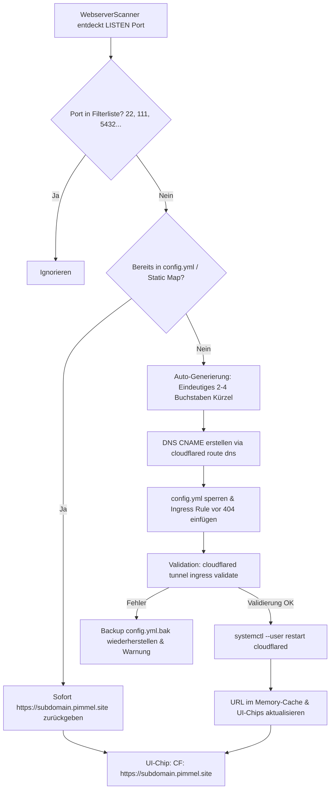

# AGY.md — Antigravity Projekt-Verknüpfung & Systemarchitektur

Projekt: agydashboard  
Pfad: `/home/yash/Projects/agydashboard`  
GitHub: `https://github.com/yash130384/agydashboard`  

## Zweck
Dashboard-Projekt. Antigravity nutzt dieses Verzeichnis als Workspace (Start mit `agy --project agydashboard` oder `cd` hierher + `agy`).

## Konventionen
- Sprache: Deutsch für Dokumentation, Englisch für Quellcode & Variablen.
- Commits: Conventional Commits `type: subject` (`fix:`, `feat:`, `docs:`, `chore:`).

---

# Architektur- & Implementierungsplan: Migration auf Cloudflare Named Tunnel (`pimmel.site`)

## 1. Zielsetzung & Übersicht

Alle Cloudflare-Tunnel des `agydashboard` werden vollständig von unzuverlässigen, temporären `*.trycloudflare.com` Quick-Tunnels auf den offiziellen Named Tunnel **`pimmel-tunnel`** unter der Domain **`pimmel.site`** umgestellt.

### Eckdaten der Infrastruktur
| Komponente | Pfad / Bezeichner | Zweck / Konfiguration |
|---|---|---|
| **Named Tunnel Name** | `pimmel-tunnel` | Fester Cloudflare Named Tunnel |
| **Tunnel UUID** | `b5c7fa60-f43e-487e-bad6-70975ca93823` | Cloudflare Tunnel ID |
| **Konfigurationsdatei** | `/home/yash/.cloudflared/config.yml` | Ingress-Regeln & Credentials |
| **Credentials Datei** | `/home/yash/.cloudflared/b5c7fa60-f43e-487e-bad6-70975ca93823.json` | Tunnel Auth Key |
| **Cloudflared Binary** | `/home/yash/bin/cloudflared` | CLI & Tunnel Connector Binary |
| **Systemd Service** | `cloudflared.service` (User Mode) | `systemctl --user restart cloudflared` |
| **Basis-Domain** | `pimmel.site` | Offizielle Domain mit Cloudflare DNS & TLS |

---

## 2. Definierte Service-Subdomains (2–4 Buchstaben)

Alle bekannten und primären Systemdienste erhalten prägnante Subdomains von 2 bis maximal 4 Buchstaben:

| Subdomain | Vollständige URL | Lokaler Port | Dienst / Prozess | Aktueller Status |
|---|---|---|---|---|
| **ha** | `https://ha.pimmel.site` | `8123` | Home Assistant Core (`hass`) | Bereits in `config.yml` & DNS aktiv |
| **ai** | `https://ai.pimmel.site` | `20128` | 9Router AI Gateway (`next-server`) | Bereits in `config.yml` & DNS aktiv |
| **dash** | `https://dash.pimmel.site` *(sowie `https://pimmel.site`)* | `5000` | agydashboard System Dashboard | `pimmel.site` aktiv; `dash` neu |
| **cast** | `https://cast.pimmel.site` | `3000` | xdcc-load-cast / PulseCast (`node`) | Neu anzulegen |
| **tele** | `https://tele.pimmel.site` | `8000` | TelemetryVault ACC Telemetry (`uvicorn`) | Neu anzulegen |
| **mat** | `https://mat.pimmel.site` | `5580` | Python Matter Server (`matter-server`) | Neu anzulegen |
| **head** | `https://head.pimmel.site` | `8787` | Headroom AI Context Compression | Neu anzulegen |

---

## 3. Architektur des dynamischen Named-Tunnel-Managers

Anstelle des bisherigen `CloudflaredTunnelManager`, der eigene Subprozesse mit `--url http://127.0.0.1:<port>` gestartet hat, übernimmt künftig ein thread-sicherer **`CloudflaredNamedTunnelManager`** die Verwaltung:



### 3.1 Subdomain-Generierungs-Algorithmus (2–4 Zeichen)
Für neu gefundene Webdienste erzeugt die Funktion `generate_subdomain(port, process_name, title)` automatisch ein valides Kürzel:
1. **Prioritäts-Lookup**: Prüfen, ob für den Port ein statischer Eintrag in `STATIC_PORT_SUBDOMAINS` existiert.
2. **Kandidaten aus Namen extrahieren**:
   - Bereinigen von `process_name` / `title` (nur `a-z0-9`, Kleinbuchstaben).
   - Generische Namen wie `python`, `node`, `docker`, `system` werden übersprungen.
   - Prägnante 3-4 Buchstaben-Präfixe (z.B. `grafana` -> `graf`, `ollama` -> `olla`, `plex` -> `plex`, `caddy` -> `cad`).
3. **Fallback bei Namenskollision oder generischen Diensten**:
   - `s` + letzte 2-3 Stellen des Ports (z.B. Port `8080` -> `s808`, Port `9000` -> `s900`, Port `4200` -> `s420`).
   - Garantiert strikt das Format: `^[a-z0-9]{2,4}$`.
4. **Kollisionsprüfung**:
   - Prüfung gegen alle bereits in `/home/yash/.cloudflared/config.yml` vorhandenen Hostnames und DNS-Reservierungen.

### 3.2 DNS-Provisionierung
Für jedes neue Kürzel wird folgender Befehl ausgeführt:
```bash
/home/yash/bin/cloudflared tunnel route dns -f pimmel-tunnel <subdomain>.pimmel.site
```
- `-f` (`--overwrite-dns`): Überschreibt eventuell verwaiste alte DNS-Records sicher.
- Nutzt die existierenden Credentials in `/home/yash/.cloudflared/cert.pem`.

### 3.3 Ingress-Regel in `config.yml` atomar einpflegen
Die Konfiguration `/home/yash/.cloudflared/config.yml` besitzt die Ingress-Struktur:
```yaml
tunnel: b5c7fa60-f43e-487e-bad6-70975ca93823
credentials-file: /home/yash/.cloudflared/b5c7fa60-f43e-487e-bad6-70975ca93823.json

ingress:
  - hostname: pimmel.site
    service: http://localhost:5000
  - hostname: dash.pimmel.site
    service: http://localhost:5000
  - hostname: ha.pimmel.site
    service: http://localhost:8123
  - hostname: ai.pimmel.site
    service: http://localhost:20128
  - hostname: cast.pimmel.site
    service: http://localhost:3000
  - hostname: tele.pimmel.site
    service: http://localhost:8000
  - hostname: mat.pimmel.site
    service: http://localhost:5580
  - hostname: head.pimmel.site
    service: http://localhost:8787
  # [Dynamische Ingress-Regeln werden hier eingefügt]
  - service: http_status:404
```
**Sicherheitsmechanismus:**
- Vor jedem Schreibvorgang wird `/home/yash/.cloudflared/config.yml.bak` erstellt.
- Neue Hostname-Einträge werden *vor* dem Catch-All `- service: http_status:404` eingefügt.
- Nach dem Schreiben erfolgt die Validierung via:
  ```bash
  /home/yash/bin/cloudflared tunnel --config /home/yash/.cloudflared/config.yml ingress validate
  ```
- Nur wenn die Validierung `OK` (Exit-Code 0) zurückgibt, wird der Daemon neu gestartet. Andernfalls erfolgt ein sofortiges Rollback.

### 3.4 Tunnel-Service Neustart
```bash
systemctl --user restart cloudflared
```
Erfolgt über Python `subprocess.run(["systemctl", "--user", "restart", "cloudflared"], check=True)`.
Ein Mutex (`threading.Lock`) und ein kurzes Cooldown-Debouncing (3–5 Sekunden) verhindern mehrfache Neustarts bei Scans mehrerer neuer Ports.

---

## 4. Vollständige Bereinigung aller alten Quick-Tunnel

1. **Beenden aller aktiven Quick-Tunnel-Prozesse**:
   - Suche aller Prozesse mit `cmdline` enthält `cloudflared` und `--url` oder `.trycloudflare.com` und Senden von `SIGTERM` / `SIGKILL`.
2. **Deaktivierung des alten systemd-Dienstes**:
   ```bash
   systemctl --user stop cloudflared-tunnels.service || true
   systemctl --user disable cloudflared-tunnels.service || true
   ```
3. **Bereinigung alter Dateien**:
   - Entfernen oder Leeren von `/tmp/cloudflared_*.log`.
   - Migration bzw. Aufräumen von `/home/yash/.cloudflared-urls/*.url`.
   - Ersetzen von `/home/yash/bin/cloudflared-tunnel.sh` durch ein Deprecation-Script oder Stilllegung.
4. **Code-Bereinigung in `app.py`**:
   - Entfernung aller Regex-Suchen nach `trycloudflare.com`.
   - Entfernung von `subprocess.Popen([self.binary_path, "tunnel", "--url", ...])`.

---

## 5. Änderungen im Detail (File by File)

### 5.1 `/home/yash/.cloudflared/config.yml`
- Eintragen der 7 festen Services (`pimmel.site`, `dash`, `ha`, `ai`, `cast`, `tele`, `mat`, `head`).
- Catch-All Regel `- service: http_status:404` am Ende sicherstellen.

### 5.2 DNS CNAMEs via Cloudflared CLI
Ausführen der initialen Registrierungen:
```bash
/home/yash/bin/cloudflared tunnel route dns -f pimmel-tunnel dash.pimmel.site
/home/yash/bin/cloudflared tunnel route dns -f pimmel-tunnel cast.pimmel.site
/home/yash/bin/cloudflared tunnel route dns -f pimmel-tunnel tele.pimmel.site
/home/yash/bin/cloudflared tunnel route dns -f pimmel-tunnel mat.pimmel.site
/home/yash/bin/cloudflared tunnel route dns -f pimmel-tunnel head.pimmel.site
```

### 5.3 `/home/yash/Projects/agydashboard/app.py`
1. **`SERVICE_REGISTRY`**:
   - Hinzufügen von `mat` (5580, `Matter Server`).
   - Vorkonfigurierte `cf_url`-Einträge:
     - `dashboard` (5000): `https://dash.pimmel.site`
     - `telemetry` (8000): `https://tele.pimmel.site`
     - `xdcc` (3000): `https://cast.pimmel.site`
     - `9router` (20128): `https://ai.pimmel.site`
     - `headroom` (8787): `https://head.pimmel.site`
     - `homeassistant` (8123): `https://ha.pimmel.site`
     - `matter` (5580): `https://mat.pimmel.site`
2. **Klasse `CloudflaredNamedTunnelManager`**:
   - `get_url(port)`: Liest statische & dynamische Zuordnungen aus `config.yml` oder Cache (`https://<subdomain>.pimmel.site`).
   - `ensure_tunnel(port, process_name="", title="")`: Prüft `config.yml`, generiert Subdomain falls unbekannt, erstellt DNS-Eintrag, fügt Ingress-Regel ein, validiert & startet `cloudflared.service` neu.
   - `kill_legacy_quick_tunnels()`: Tötet laufende Quick-Tunnel-Prozesse beim Start.
   - `stop_tunnel(port)`: Entfernt Ingress-Regel optional bei Dienst-Beendigung oder belässt sie persistent.
3. **`get_cloudflared_urls()`**:
   - Gibt das Mapping aller Ports/Dienste auf ihre `https://<subdomain>.pimmel.site` URLs zurück.
4. **`WebserverScanner.scan()` & `get_cloudflared_map()`**:
   - Verwendet direkt `cf_tunnel_manager.get_all_urls()` bzw. `ensure_tunnel(port)`.
   - Bereitstellung sauberer `cloudflared_url` Werte für alle erkannten Server.
5. **UI-Chips & Templates**:
   - Jinja2-Template & JavaScript-Aktualisierung:
     - Badge zeigt direkt den sauberen Link: `☁️ CF: https://<subdomain>.pimmel.site` (oder gekürzt `☁️ <subdomain>.pimmel.site`).
     - Kein Lade-Hänger mehr wegen fehlender Quick-Tunnel-Logs.

---

## 6. Verifikationsplan

### Schritt 1: DNS- und Tunnel-Auflösung
```bash
python3 -c "
import socket
for sub in ['dash', 'ha', 'ai', 'cast', 'tele', 'mat', 'head']:
    host = f'{sub}.pimmel.site'
    print(host, '->', socket.gethostbyname(host))
"
```
*Erwartung*: Alle 7 Subdomains lösen auf Cloudflare Edge IPs (z.B. `188.114.96.4` / `188.114.97.4`) auf.

### Schritt 2: Ingress-Konfiguration und Validierung
```bash
/home/yash/bin/cloudflared tunnel --config /home/yash/.cloudflared/config.yml ingress validate
```
*Erwartung*: `Validating rules... OK`.

### Schritt 3: Systemd-Status & Prozessprüfung
```bash
systemctl --user status cloudflared
systemctl --user status cloudflared-tunnels.service  # Soll inaktiv/disabled sein
ps aux | grep -E "cloudflared.*--url"               # Soll 0 Treffer liefern
```

### Schritt 4: End-to-End HTTP(S)-Aufrufe
Prüfung der HTTPS-Routen von extern/über Cloudflare:
- `https://dash.pimmel.site` -> HTTP 200 (agydashboard)
- `https://ha.pimmel.site` -> Home Assistant Login
- `https://ai.pimmel.site` -> 9Router Gateway
- `https://cast.pimmel.site` -> PulseCast / XDCC
- `https://tele.pimmel.site` -> TelemetryVault
- `https://mat.pimmel.site` -> Matter Server

### Schritt 5: Dynamische Auto-Generierung testen
Simulierter Testlauf: Starten eines Test-HTTP-Servers auf Port 8899:
```bash
python3 -m http.server 8899 &
```
- Überprüfen, ob `agydashboard` den Server erkennt.
- Überprüfen, ob ein 2-4 Buchstaben-Kürzel generiert wird.
- Überprüfen, ob `config.yml` aktualisiert und `cloudflared` neu gestartet wird.
- Beenden des Test-Servers.

### Schritt 6: Dashboard-UI Verifikation
Aufruf des Dashboards unter `http://localhost:5000` bzw. `https://dash.pimmel.site`:
- Überprüfung der Chips in der LCARS Webserver-Liste: Jeder Server zeigt einen `☁️ CF: https://<subdomain>.pimmel.site` Chip, der per Klick die Seite öffnet.
